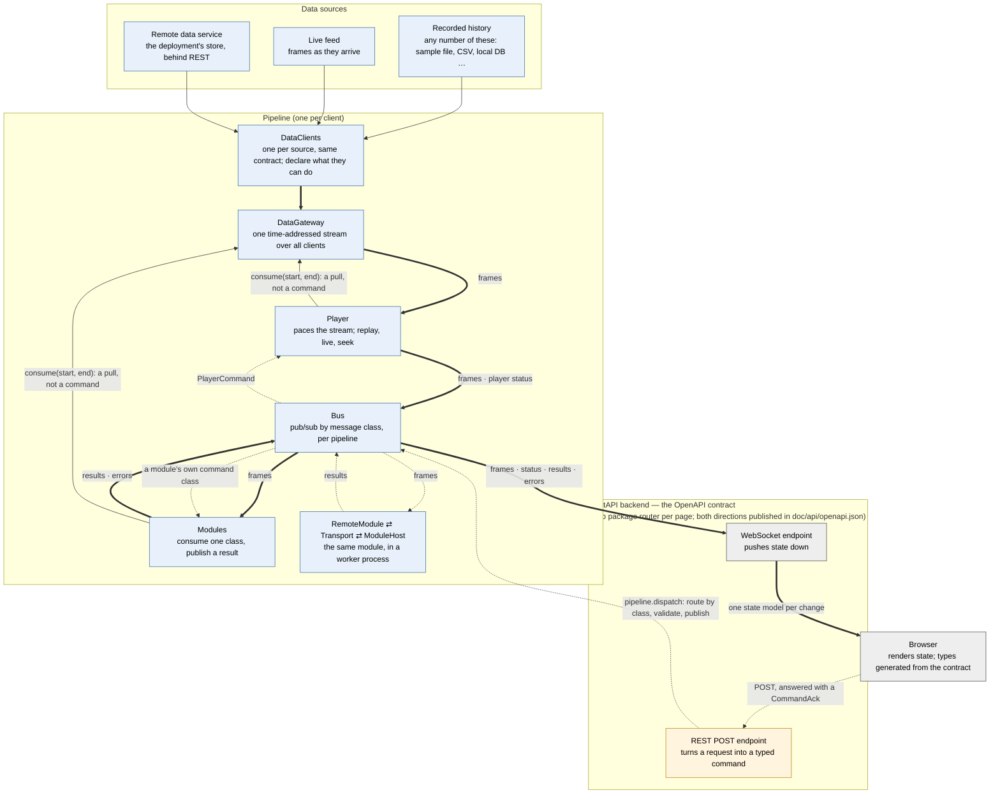
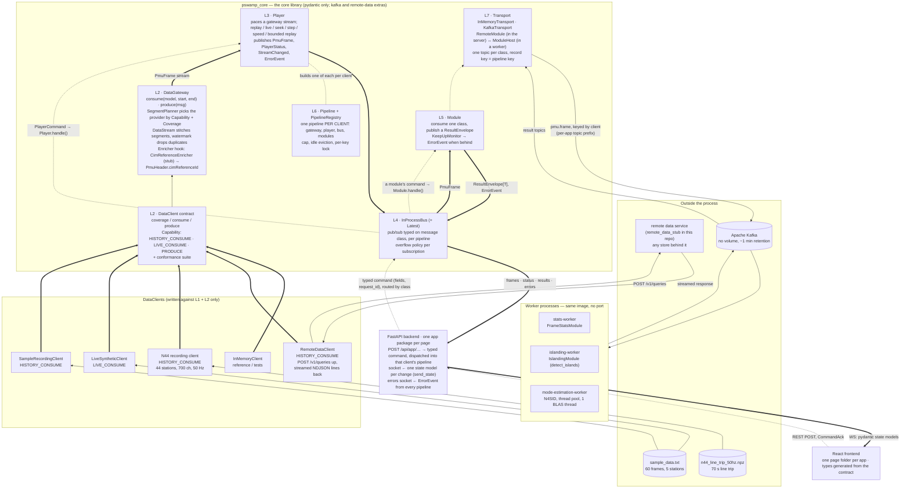
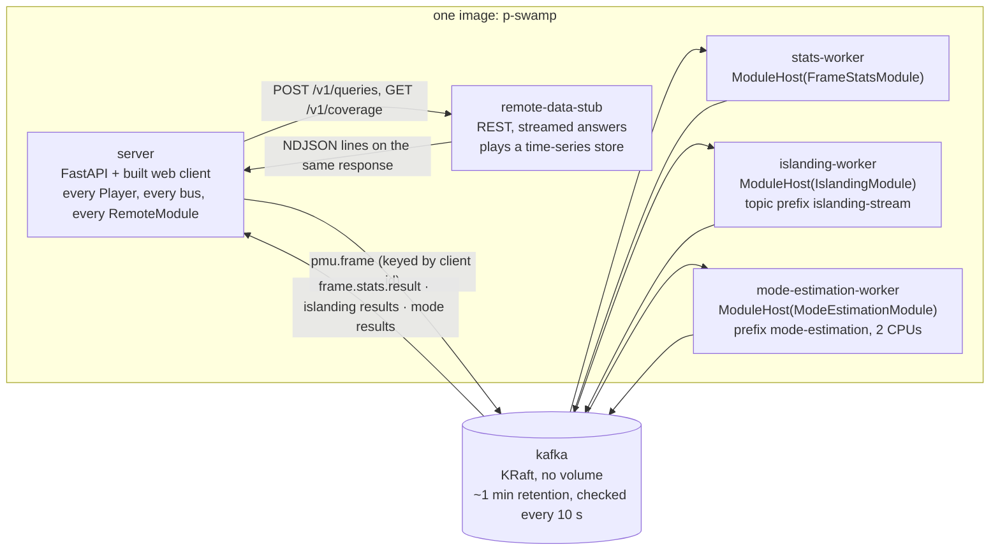
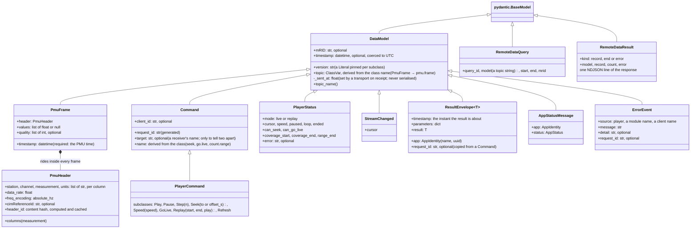

# The server data architecture, in diagrams

Louis Pauchet's draft architecture diagram (`PSWAMP_DataArchitecture.drawio`,
two pages: the system view and the exchange models) was the starting point for
the data architecture under `core/`. This document redraws both pages against
what is actually built, and lists, box by box, what matched, what was renamed,
what turned out different and what is not built. Scope is the **pipeline
architecture only**: the `core/` library and the vertical slice of apps hooked
up to it (the PMU test streamer first, then the explorer, frequency peek,
islanding stream and mode estimation). The grid monitor at `/` is not covered
here.

The code referred to is `core/src/pswamp_core/` (the library) and
`app/server-python/src/<app>/` (the apps over it). `doc/server-data-architecture.md`
is the prose behind it.

Legend for the flowcharts, mirroring Louis's three arrow kinds:

| Louis's arrow | Here | Meaning |
|---|---|---|
| bold solid "Pydantic Model Data Flux" | `==>` thick | a `DataModel` (or a pydantic view of one) moving between two pieces |
| dashed "Client Specific Data Flux" | `-->` thin | a provider- or deployment-specific protocol: a file read, a REST call, a Kafka record |
| dash-dot "Orchestrator Command" | `-.->` dotted | a typed command on a bus, or a POST that becomes one |

## 1. The pipeline, conceptually

One pipeline per browser client. Data flows down the left, commands travel up
the right, and the bus is where the two meet. Names only; the details are in
the sections after this one.

Reading it:

- **Data flows down** from a source through its `DataClient` into the
  `DataGateway`. Sources are interchangeable behind that one contract: a
  recorded sample file, a CSV, a local database, a live feed, a remote data
  service, any number of them at once. The gateway stitches them into one
  time-addressed stream and hands it to the `Player`, which paces it onto
  the `Bus`. Modules read frames off the bus and put
  results back on it. The web edge subscribes to the bus and pushes whatever
  changed down the socket.
- **Both directions pass through the FastAPI backend**, and both are
  published in the one generated OpenAPI contract: the POST operations as
  ordinary paths, the socket channels as schemas plus an extension. The
  browser's TypeScript types are generated from it.
- **Commands travel up**: a browser action is a REST POST, answered only with
  an acknowledgement; the endpoint builds one typed command (`SeekCommand`,
  `CountRangeCommand`, …) and the pipeline routes it by its class to the one
  receiver that declared it -- the player, or a module listing it in
  `commands` -- which checks it before it is published (a refusal is the
  POST's 409) and applies it off the bus. A frame-driven module never sees one. A command never reaches
  the gateway or a data client: the gateway has no bus. The player or the
  module calls `consume(start, end)` on it, the planner picks a client by
  coverage and capability, and that client's own `consume(range)` is how it
  learns which range is wanted. A seek is a new `consume` from a new start.
- **A module can leave the process** without anything else noticing: a
  `RemoteModule` stands in its slot, a `Transport` carries frames out and
  results back, and a `ModuleHost` in a worker runs the real module.
- **Everything on an arrow is a pydantic message.**

## 2. System view, consolidated

What the picture says that Louis's did not: there is a **Player** between the
gateway and everything else, a **bus** that is per pipeline rather than one
process-wide hub, a **pipeline registry** that builds all of it per browser,
a **Module** contract with a keep-up check, and a **Transport** that carries a
module out to a worker while the player and the commands stay in the server.
What Louis's picture had that this one does not: Prometheus, a
`ServiceManager` with a lifecycle API, the CIM graph stack, and the four
concrete data clients on the left of his drawing.

## 3. Box-by-box: Louis's view against what is built

### Left half — the core library

| Louis's box | What is built | Status |
|---|---|---|
| **pSwamp Core Librairie** | `pswamp_core` under `core/`, pydantic as the only default dependency, `[kafka]` and `[remote-data]` extras | Built. Eight layers, each importing only the ones below (`doc/server-data-architecture.md` "The layers"). |
| **DataGateway** | `datagateway/data_gateway.py` + `planner.py` + `stream.py` + `time_range.py`. Two verbs, `consume(model, start, end)` and `produce(msg)`; a seek and a chunk are the same call | Built, lifted from Louis's `test_pswamp` draft. Added since the draft: `Capability` flags, `Coverage` re-asked per segment, the live hand-off margin, the watermark, and the **enricher hook**. |
| **"Connect Stream"** (gateway → LazyCIM) | Reversed: the gateway does not connect to the CIM side, the CIM side is pulled *into the stream*. The stub `CimReferenceEnricher` stamps `PmuHeader.cimReferenceId` on every frame, deciding it once per layout in `reference_for`; today that returns a configured placeholder | Different shape, stubbed. Only the reference rides with the frame, stamped early; anything later in the pipeline, a worker included, reads it off the frame. A CIM-backed enricher overrides `reference_for`. |
| **DataHub** (CIM graph + profile + gateway + converters) | Split in two: the *data* part is `DataGateway`; the *fan-out* part, which the draft did not have, is `InProcessBus` (typed on message classes, per pipeline, overflow policy per subscription, `Latest` for the newest message per class). No CIM graph connection anywhere. | Not built as one object, on purpose. The gateway is a pull facing the source with one reader; the bus is a push facing the consumers with many. Both are needed and they are not the same thing (see "Why not the gateway alone" in the doc). |
| **LazyCIM / RDFLib / KGraphPy / Validator / GraphDB / Apache Jena** | Nothing yet. The seam is `CimReferenceEnricher.reference_for` in the gateway. | Not built. No CIM model, no triple store, no SPARQL, no CIM profile validation. Parked as a track of its own when the draft was evaluated. |
| **PMUC37Client / C37.118** | No `DataClient` speaks C37.118. | Not built. Listed under "not here yet": a `PmuFrameAssembler` for deployments that ingest per-PMU messages. |
| **ClickHouseClient / ClickHouse** | `RemoteDataClient`: a `DataClient` over a **remote data service** the deployment runs in front of *whatever* store it has. Range query up as `POST /v1/queries`, coverage as `GET /v1/coverage`, records back as that call's streamed response, one `RemoteDataResult` NDJSON line each, closed by `end`/`error`; closing the connection cancels. Contract in `doc/remote-data-integration-contract.md` (HTTP only). `core/examples/remote_data_stub/` is the dummy service. | Different by design: no store-specific client in the repo. ClickHouse would be one implementation of the service, chosen and changed by the deployment. |
| **KafkaClient (as data source) / NAPS** | No broker-as-source. Kafka here is a **transport** behind the bus (`transport/kafka.py`), never a `DataClient`: a time-addressed `DataStream` would drop the timestamps a looping replay sends backwards. | Not built as a provider; "a broker as history" is on the open list. NAPS has no counterpart. |
| *(no box)* | **Player** (`datagateway/player.py`): paces a gateway stream, owns replay/live/pause/step/seek/speed and bounded replay; seek is a new stream; mode is which stream is open; commands come off the bus; provider failure ends the stream paused with `PlayerStatus.error` and an `ErrorEvent`. | Built, missing from Louis's view. |
| *(no box)* | **Module** (`modules.py`): `name`, `input_model`, `output_model`, `process()`; `run` subscribes, wraps the answer in a `ResultEnvelope` and publishes. `KeepUpMonitor` reports dropped or stale input on the error topic. | Built; this is what an `IslandingDetector` or `StateEstimator` box *is* here. |
| *(no box)* | **Pipeline + PipelineRegistry** (`pipeline.py`): one gateway, player, bus and module list per key; the key is the browser's client id today; per-key lock, cap, idle eviction, refusal at the cap. | Built. Everything is per client; a shared live stream keyed per stream is designed, not built. |
| *(no box)* | **Transport / RemoteModule / ModuleHost** (`transport/`, `remote.py`): the module's slot in the pipeline is taken by a `RemoteModule` that carries its input class to a topic and its result back; a `ModuleHost` in a worker runs the real module, one instance per key, evicting idle keys. `InMemoryTransport` for tests, `KafkaTransport` for compose and k8s. | Built. Switched by one env var per app (`*_MODULE_TRANSPORT`); unset, the module runs in-process. |
| *(no box)* | **Conformance suite** (`datagateway/conformance.py`): inherit, three fixtures, cases follow the declared capabilities. | Built. Every provider in the repo runs it. |

### Right half — the modules and their orchestration

| Louis's box | What is built | Status |
|---|---|---|
| **Namespace / Branch** holding **StateEstimator**, **IslandingDetector** | The module list of each app's `build_pipeline`, and the worker services in compose/k8s: `FrameStatsModule` (stats-worker), `IslandingModule` over `detect_islands` (islanding-worker), N4SID `ModeEstimationModule` (mode-estimation-worker), `RowCountModule` and `FrequencyModule` in-process. | The *set* of modules exists; the *namespace* does not. Isolation comes from the pipeline key and a per-app topic prefix, not from a namespace object. |
| **DataModel / CommandModel / ResultModel** arrows into each module | Exactly this, as bus subscriptions: `PmuFrame` in, `ResultEnvelope[T]` out, a command routed by its class to the module that lists it in `commands` (the explorer's `RowCountModule` is the worked example). | Built, in-process and in a worker: a `RemoteModule` forwards its module's commands over the transport. A module that reads the gateway itself cannot be hosted yet: `ModuleHost` hands the module an empty gateway. |
| **ServiceManager** with **Start / Deploy / ManageLifeCycle** | `docker-compose.yml` and `k8s/p-swamp-local.yaml`: six containers from one image, workers are plain processes with no port. `ModuleHost` manages module *instances* per key; nothing manages *processes*. | Not built. Lifecycle is the orchestrator's (compose, k8s), not a p-SWAMP service. |
| **Prometheus** | None. What exists instead is the **error topic**: `ErrorEvent` from the player, a module, a transport queue, or the keep-up check, forwarded per client into `/api/errors/ws` and the layout's error tray. Throughput numbers so far are hand-measured. | Not built. A metrics endpoint is an open point. |

### Top — the edge

| Louis's box | What is built | Status |
|---|---|---|
| **FastAPI Backend** | `server.py` mounting one router per app package under `/api/<app>/`; commands are POSTs that build one typed command, dispatched into that client's pipeline (404 without one, 409 when refused), and answer with a `CommandAck` that never carries state; the socket pushes one pydantic state model per change through `send_state`. | Built. Plus a generated OpenAPI contract including the socket channels (`doc/api/openapi.json`, `schema.ts`). |
| **React Frontend** | One folder per page, wire types generated from the contract, commands through `postCommand`. | Built. |
| **WS / RestAPI** | As drawn: state down the socket, commands up as REST. | Built. |

## 4. Deployment view (what compose and the local k8s manifest run)

Nothing here is a dependency of the server: unset `*_MODULE_TRANSPORT` and a
module runs in-process, unset `TIME_SERIES_EXPLORER_DATA_CLIENTS` and the
explorer runs over the sample recording. CI's bare `docker run` is that
configuration. No database and no volume anywhere.

## 5. Exchange models, consolidated

Louis's page 2 against `core/src/pswamp_core/messages/`.

| Louis's model | What is built | Status |
|---|---|---|
| `DataModel` with `mRID`, `version`, `namespace`, `timestamp`, `get_topic(UUID)` | `DataModel` with `version` (a `Literal` per subclass), `mRID` (optional), `timestamp` (optional, UTC), `topic` derived from the class name and overridable as a `ClassVar`. No `namespace`. A private `_sent_at` set by transports. | Kept, minus `namespace`. The topic is a class property, not a function of a UUID: the set of `DataModel` subclasses *is* the topic catalogue. Isolation between clients is the record key on the topic, so no `DataModel` gained a field for it. |
| `DataFrame` with `values`, `header`, `headerId` | `PmuFrame` with `values`, `header: PmuHeader`, and `header_id` as a content hash **on the header**, computed and cached. `quality` added as a place for the C37.118 STAT word. | Kept in spirit; PMU-specific by name. |
| `DataFrameValues` and `DataFrameHeader` as two separate models | **Not split.** The header rides inside every frame (~1 KB repeated per frame for the sample, a few bytes more for the CIM reference; about 1.2x on the wire once Kafka batch compression collapses the repeats). In return any single frame is self-describing: a late worker, a live source and a changed layout all work off the frame in hand, with no priming message. | Decided the other way, with the measurement in the docstring of `messages/pmu.py`. Revisit if the wire cost ever dominates. |
| `Measurement` | No generic `Measurement` class. `PmuFrame` is the one measurement shape: one instant of every channel plus its layout. The core's own tests run the chain on a non-PMU `DataModel` to prove nothing is PMU-specific below the messages. | Different. Louis's per-PMU-per-quantity objects were dropped in favour of the frame. |
| `Command` | A typed `Command` base with `request_id`, `client_id`, an optional `target`; one subclass per operation, whose fields are its arguments. | Kept as a base; the draft's verb-and-args shape became one class per command, routed by class. |
| *(none)* | `PlayerStatus`, `StreamChanged`, `ResultEnvelope[T]`, `AppIdentity`, `AppStatusMessage`, `ErrorEvent`, `RemoteDataQuery`, `RemoteDataResult`. | Added. Everything a bus, a topic or a socket carries is one of these. |

## 6. Not built, in one list

From Louis's view: Prometheus; `ServiceManager`; the CIM graph stack (LazyCIM,
RDFLib/KGraphPy, Validator, GraphDB, Apache Jena); `PMUC37Client`;
`ClickHouseClient`; a Kafka `DataClient` as a source; NAPS; `namespace` on
`DataModel`; the `DataFrameValues` / `DataFrameHeader` split; a generic
`Measurement` model.

From the core's own open list: `request_id` returned to the browser in the acknowledgement; a
module that reads the gateway running in a worker (needs a gateway factory in `ModuleHost`);
proxy settings for `RemoteDataClient`'s long-lived streamed responses; a broker as history; a
`PmuFrameAssembler` for per-PMU ingest; the throughput fixes the first load tests point at
(cheaper frames, producer batching, keyed partitions, sub-millisecond pacing).
