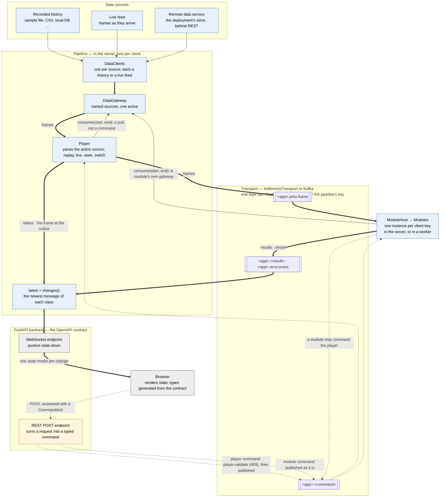
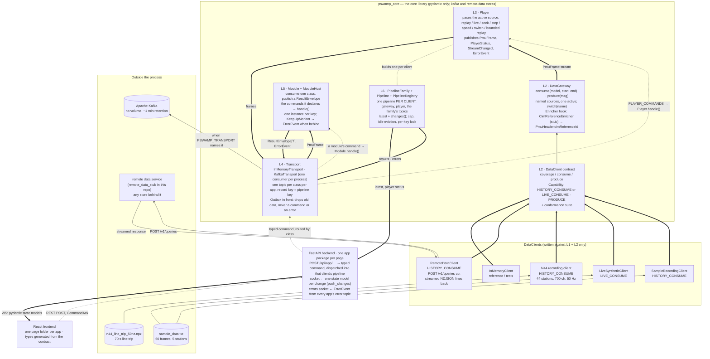
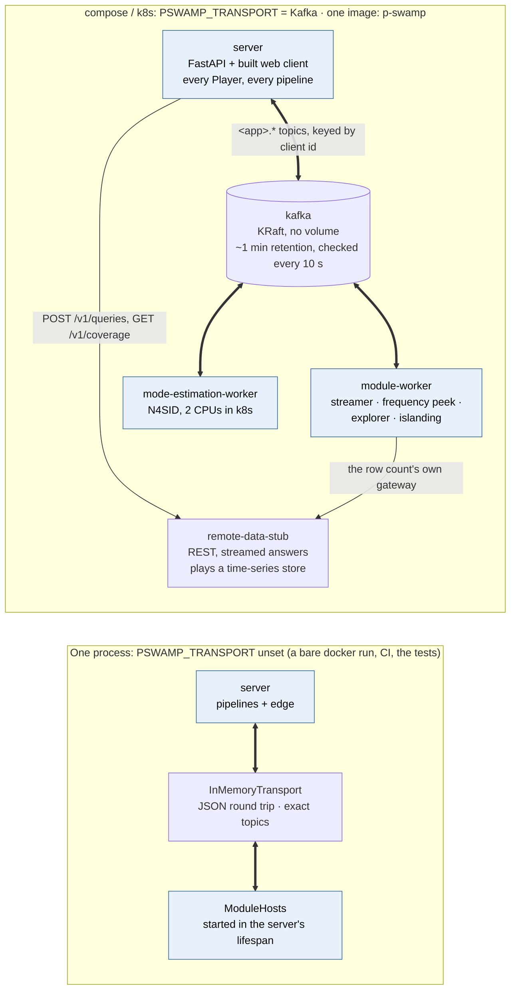
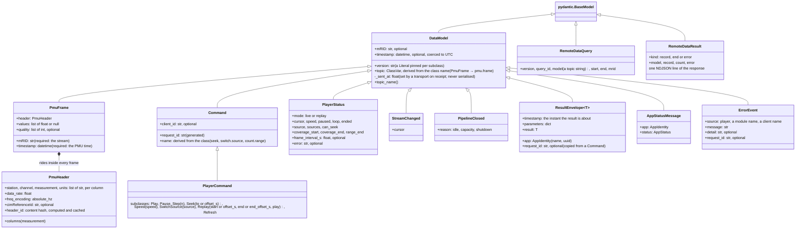

# The server data architecture, in diagrams

Louis Pauchet's draft architecture diagram (`PSWAMP_DataArchitecture.drawio`,
two pages: the system view and the exchange models) was the starting point for
the data architecture under `core/`. This document redraws both pages against
what is actually built, and lists, box by box, what matched, what was renamed,
what turned out different and what is not built. Scope is the **pipeline
architecture only**: the `core/` library and the vertical slice of apps hooked
up to it (the PMU test streamer first, then the explorer, frequency peek,
islanding stream and mode estimation). The grid monitor at `/` is not covered
here.

The code referred to is `core/src/pswamp_core/` (the library) and
`app/server-python/src/<app>/` (the apps over it). `doc/server-data-architecture.md`
is the prose behind it.

Legend for the flowcharts, mirroring Louis's three arrow kinds:

| Louis's arrow | Here | Meaning |
|---|---|---|
| bold solid "Pydantic Model Data Flux" | `==>` thick | a `DataModel` (or a pydantic view of one) moving between two pieces |
| dashed "Client Specific Data Flux" | `-->` thin | a provider- or deployment-specific protocol: a file read, a REST call, a Kafka record |
| dash-dot "Orchestrator Command" | `-.->` dotted | a typed command on its topic, or a POST that becomes one |

## 1. The pipeline, conceptually

One pipeline per browser client, in the server; one module instance per
client, wherever its host runs; the transport between them. Data flows down,
commands flow up. Names only; the details are in the sections after this one.

```
DATA DOWN    source → DataClient (the active one) → DataGateway → Player
             → topic <app>.pmu.frame (key = pipeline) → Module → topic <app>.<result> → edge → socket → browser
COMMANDS UP  browser → POST → edge → validate at the player (the 409) → topic <app>.<command> → Player | Module
             a Module may publish a command too (e.g. SwitchSourceCommand)
STATE        the edge builds one state model per change: the newest result per class (Latest) + the local player
WHERE        transport unset → InMemoryTransport, modules hosted in the server; set → Kafka, modules in the worker
```


```mermaid
flowchart TB
    classDef data fill:#e8f1fb,stroke:#3b6ea5,color:#000
    classDef cmd fill:#fff4dd,stroke:#b8860b,color:#000
    classDef edge fill:#eeeeee,stroke:#555,color:#000

    subgraph sources["Data sources"]
        direction LR
        rec["Recorded history<br/>sample file, CSV, local DB …"]:::data
        live["Live feed<br/>frames as they arrive"]:::data
        rds["Remote data service<br/>the deployment's store, behind REST"]:::data
    end

    subgraph pipeline["Pipeline — in the server, one per client"]
        direction TB
        clients["DataClients<br/>one per source; each a history or a live feed"]:::data
        gateway["DataGateway<br/>named sources, one active"]:::data
        player["Player<br/>paces the active source; replay, live, seek, switch"]:::data
        view["latest + changes()<br/>the newest message of each class"]:::data
    end

    subgraph transport["Transport — InMemoryTransport or Kafka<br/>one topic per class per app · record key = the pipeline's key"]
        direction LR
        tf[["&lt;app&gt;.pmu.frame"]]
        tr[["&lt;app&gt;.&lt;result&gt; · &lt;app&gt;.error.event"]]
        tc[["&lt;app&gt;.&lt;command&gt;"]]
    end

    host["ModuleHost → Modules<br/>one instance per client key<br/>in the server, or in a worker"]:::data

    subgraph fastapi["FastAPI backend — the OpenAPI contract"]
        direction LR
        socket["WebSocket endpoint<br/>pushes state down"]:::edge
        post["REST POST endpoint<br/>turns a request into a typed command"]:::cmd
    end
    browser["Browser<br/>renders state; types generated from the contract"]:::edge

    rec --> clients
    live --> clients
    rds --> clients
    clients ==> gateway
    gateway ==>|"frames"| player
    player ==>|"frames"| tf
    tf ==> host
    host ==>|"results · errors"| tr
    tr ==> view
    player ==>|"status · the frame at the cursor"| view
    view ==> socket
    socket ==>|"one state model per change"| browser

    browser -.->|"POST, answered with a CommandAck"| post
    post -.->|"player command: player.validate (409), then published"| tc
    post -.->|"module command: published as it is"| tc
    tc -.-> player
    tc -.-> host
    host -.->|"a module may command the player"| tc
    player -->|"consume(start, end): a pull, not a command"| gateway
    host -->|"consume(start, end): a module's own gateway"| gateway
```

Reading it:

- **Data flows down** from a source through its `DataClient` into the
  `DataGateway`, which reads one of its sources at a time, the active one, and
  hands the stream to the `Player`. The player paces it and publishes each
  frame on the app's frame topic under the pipeline's key; the module instance
  for that key reads it, and its result comes back on the result topic into
  the pipeline's `latest`. The socket pushes one state model per change.
- **Commands travel up**: a browser action is a REST POST, answered only with
  an acknowledgement; the endpoint builds one typed command and publishes it on
  its class's topic. A player command is checked first (a refusal is the POST's
  409); a module command is checked where the module runs, and a refusal comes
  back as an `ErrorEvent` carrying the command's `request_id`. A command never
  reaches a data client: the player or a module calls `consume(start, end)`,
  and a `SwitchSourceCommand` to the player is what changes the active source.
- **Where a module runs is the transport's business**: in-memory, the server
  hosts it; with Kafka, a worker does. Nothing else in the picture changes.
- **Everything on an arrow is a pydantic message.**

## 2. System view, consolidated


```mermaid
flowchart BT
    browser["React frontend<br/>one page folder per app · types generated from the contract"]
    edge["FastAPI backend · one app package per page<br/>POST /api/app/… → typed command, dispatched into that client's pipeline<br/>socket ← one state model per change (push_changes)<br/>errors socket ← ErrorEvent from every app's error topic"]
    browser -.->|"REST POST, CommandAck"| edge
    edge ==>|"WS: pydantic state models"| browser

    subgraph core["pswamp_core — the core library (pydantic only; kafka and remote-data extras)"]
        direction TB
        registry["L6 · PipelineFamily + Pipeline + PipelineRegistry<br/>one pipeline PER CLIENT: gateway, player, the family's topics<br/>latest + changes(); cap, idle eviction, per-key lock"]
        player["L3 · Player<br/>paces the active source; replay / live / seek / step / speed / switch / bounded replay<br/>publishes PmuFrame, PlayerStatus, StreamChanged, ErrorEvent"]
        transport["L4 · Transport<br/>InMemoryTransport · KafkaTransport (one consumer per process)<br/>one topic per class per app, record key = pipeline key<br/>Outbox in front: drops old data, never a command or an error"]
        modules["L5 · Module + ModuleHost<br/>consume one class, publish a ResultEnvelope<br/>the commands it declares → handle()<br/>one instance per key; KeepUpMonitor → ErrorEvent when behind"]
        gateway["L2 · DataGateway<br/>consume(model, start, end) · produce(msg)<br/>named sources, one active; switch(name)<br/>Enricher hook: CimReferenceEnricher (stub) → PmuHeader.cimReferenceId"]
        contract["L2 · DataClient contract<br/>coverage / consume / produce<br/>Capability: HISTORY_CONSUME or LIVE_CONSUME · PRODUCE<br/>+ conformance suite"]
    end

    edge -.->|"typed command, routed by class"| transport
    transport -.->|"PLAYER_COMMANDS → Player.handle()"| player
    transport -.->|"a module's command → Module.handle()"| modules
    gateway ==>|"PmuFrame stream"| player
    player ==>|"frames"| transport
    transport ==>|"PmuFrame"| modules
    modules ==>|"ResultEnvelope[T], ErrorEvent"| transport
    transport ==>|"results · errors"| registry
    registry ==>|"latest, player status"| edge
    registry -. "builds one per client" .- player
    contract --> gateway

    subgraph providers["DataClients (written against L1 + L2 only)"]
        direction LR
        rec["SampleRecordingClient<br/>HISTORY_CONSUME"]
        live["LiveSyntheticClient<br/>LIVE_CONSUME"]
        n44["N44 recording client<br/>HISTORY_CONSUME<br/>44 stations, 700 ch, 50 Hz"]
        rdc["RemoteDataClient<br/>HISTORY_CONSUME<br/>POST /v1/queries up,<br/>streamed NDJSON lines back"]
        mem["InMemoryClient<br/>reference / tests"]
    end
    rec ==> contract
    live ==> contract
    n44 ==> contract
    rdc ==> contract
    mem ==> contract

    subgraph stores["Outside the process"]
        direction LR
        f1[("sample_data.txt<br/>60 frames, 5 stations")]
        f2[("n44_line_trip_50hz.npz<br/>70 s line trip")]
        rds["remote data service<br/>(remote_data_stub in this repo)<br/>any store behind it"]
        kafka[("Apache Kafka<br/>no volume, ~1 min retention")]
    end
    f1 --> rec
    f1 --> live
    f2 --> n44
    rdc -->|"POST /v1/queries"| rds
    rds -->|"streamed response"| rdc
    transport -->|"when PSWAMP_TRANSPORT names it"| kafka
```

What the picture says that Louis's did not: there is a **Player** between the
gateway and everything else, a **pipeline registry** that builds it per
browser, a **Module** contract with a host and a keep-up check, and a
**Transport** that is the one publish/subscribe -- in-memory in one process,
Kafka between processes -- while the player and the commands' checks stay in
the server. What Louis's picture had that this one does not: Prometheus, a
`ServiceManager` with a lifecycle API, the CIM graph stack, and the four
concrete data clients on the left of his drawing.

## 3. Box-by-box: Louis's view against what is built

### Left half — the core library

| Louis's box | What is built | Status |
|---|---|---|
| **pSwamp Core Librairie** | `pswamp_core` under `core/`, pydantic as the only default dependency, `[kafka]` and `[remote-data]` extras | Built. Eight layers, each importing only the ones below (`doc/server-data-architecture.md` "The layers"). |
| **DataGateway** | `datagateway/data_gateway.py` + `stream.py` + `time_range.py`. Named sources, one active (`switch(name)`); two verbs, `consume(model, start, end)` on the active source and `produce(msg)`; a seek and a chunk are the same call | Built, lifted from Louis's `test_pswamp` draft. Added since the draft: `Capability` flags (a source is a history or a live feed), and the **enricher hook**. Dropped: the draft's routing of one stream across several clients (segments, priority, stitching). |
| **"Connect Stream"** (gateway → LazyCIM) | Reversed: the gateway does not connect to the CIM side, the CIM side is pulled *into the stream*. The stub `CimReferenceEnricher` stamps `PmuHeader.cimReferenceId` on every frame, deciding it once per layout in `reference_for`; today that returns a configured placeholder | Different shape, stubbed. Only the reference rides with the frame, stamped early; anything later in the pipeline, a worker included, reads it off the frame. A CIM-backed enricher overrides `reference_for`. |
| **DataHub** (CIM graph + profile + gateway + converters) | Split in two: the *data* part is `DataGateway`; the *fan-out* part, which the draft did not have, is the `Transport` (one topic per message class per app, the pipeline key on every record, an overflow policy per subscription), with the pipeline's `latest` as the newest message per class. No CIM graph connection anywhere. | Not built as one object, on purpose. The gateway is a pull facing the source with one reader; the transport is a push facing the consumers with many. |
| **LazyCIM / RDFLib / KGraphPy / Validator / GraphDB / Apache Jena** | Nothing yet. The seam is `CimReferenceEnricher.reference_for` in the gateway. | Not built. No CIM model, no triple store, no SPARQL, no CIM profile validation. Parked as a track of its own when the draft was evaluated. |
| **PMUC37Client / C37.118** | No `DataClient` speaks C37.118. | Not built. Listed under "not here yet": a `PmuFrameAssembler` for deployments that ingest per-PMU messages. |
| **ClickHouseClient / ClickHouse** | `RemoteDataClient`: a `DataClient` over a **remote data service** the deployment runs in front of *whatever* store it has. Range query up as `POST /v1/queries`, coverage as `GET /v1/coverage`, records back as that call's streamed response, one `RemoteDataResult` NDJSON line each, closed by `end`/`error`; closing the connection cancels. Contract in `doc/remote-data-integration-contract.md` (HTTP only). `core/examples/remote_data_stub/` is the dummy service. | Different by design: no store-specific client in the repo. ClickHouse would be one implementation of the service, chosen and changed by the deployment. |
| **KafkaClient (as data source) / NAPS** | No broker-as-source. Kafka here is a **transport** (`transport/kafka.py`), never a `DataClient`: a transport carries what was published in order, and never reads the timestamps a looping replay sends backwards. | Not built as a provider; "a broker as history" is on the open list. NAPS has no counterpart. |
| *(no box)* | **Player** (`datagateway/player.py`): paces the active source's stream, owns pause/step/seek/speed, bounded replay and the source switch; seek is a new stream; mode is the active source's kind; commands arrive on their topics; provider failure ends the stream paused with `PlayerStatus.error` and an `ErrorEvent`. | Built, missing from Louis's view. |
| *(no box)* | **Module** (`modules.py`): `name`, `input_model`, `output_model`, `process()`; `run` reads its input queue, wraps the answer in a `ResultEnvelope` and publishes it. A module may also answer commands (concrete classes in `commands`, `handle()`, `validate()`), and one that reads the gateway gets its own in `setup`. `KeepUpMonitor` reports dropped or stale input on the error topic. | Built; this is what an `IslandingDetector` or `StateEstimator` box *is* here. |
| *(no box)* | **PipelineFamily + Pipeline + PipelineRegistry** (`pipeline.py`): an app's family names its topics' namespace, its gateway and its module classes; a pipeline is a gateway, a player and the family's topics under one key (the browser's client id today); per-key lock, cap, idle eviction, refusal at the cap. | Built. Everything is per client; a shared live stream keyed per stream is designed, not built. |
| *(no box)* | **Transport / ModuleHost / worker** (`transport/`, `host.py`, `worker.py`): a module is always reached over the transport; a `ModuleHost` runs one instance per key, dropping it on `PipelineClosed` or after an idle sweep. `InMemoryTransport` hosts the modules in the server; `KafkaTransport` with `python -m pswamp_core.worker` hosts them in workers. | Built. One variable for the deployment, `PSWAMP_TRANSPORT`; unset, one process. |
| *(no box)* | **Conformance suite** (`datagateway/conformance.py`): inherit, three fixtures, cases follow the declared capabilities. | Built. Every provider in the repo runs it. |

### Right half — the modules and their orchestration

| Louis's box | What is built | Status |
|---|---|---|
| **Namespace / Branch** holding **StateEstimator**, **IslandingDetector** | Each app's `PipelineFamily` (`<app>/family.py`), hosted by the worker services in compose/k8s: `FrameStatsModule`, `FrequencyModule`, `RowCountModule` and `IslandingModule` over `detect_islands` in the module-worker; N4SID `N4SIDModule` in the mode-estimation-worker. | The *set* of modules exists, and the app is a namespace of sorts: every topic is `<app>.<model>`, and the pipeline key keeps clients apart. |
| **DataModel / CommandModel / ResultModel** arrows into each module | Exactly this, as topics: `PmuFrame` in, `ResultEnvelope[T]` out, a command on its class's topic to the module that lists it in `commands` (the explorer's `RowCountModule` is the worked example). | Built, the same wherever the module is hosted. Refused when a family is declared: two receivers of one command class, and a command class that is not concrete (a topic carries one class). |
| **ServiceManager** with **Start / Deploy / ManageLifeCycle** | `docker-compose.yml` and `k8s/p-swamp-local.yaml`: five containers, four from the one `p-swamp` image plus the Apache Kafka image; workers are plain processes with no port. `ModuleHost` manages module *instances* per key; nothing manages *processes*. | Not built. Lifecycle is the orchestrator's (compose, k8s), not a p-SWAMP service. |
| **Prometheus** | None. What exists instead is the **error topic**: `ErrorEvent` from the player, a module, a transport queue, or the keep-up check, forwarded per client into `/api/errors/ws` and the layout's error tray. Throughput numbers so far are hand-measured. | Not built. A metrics endpoint is an open point. |

### Top — the edge

| Louis's box | What is built | Status |
|---|---|---|
| **FastAPI Backend** | `server.py` mounting one router per app package under `/api/<app>/`; commands are POSTs that build one typed command, dispatched into that client's pipeline (404 without one, 409 when the player refuses it), and answer with a `CommandAck` that never carries state; the socket pushes one pydantic state model per change (`push_changes`). | Built. Plus a generated OpenAPI contract including the socket channels (`doc/api/openapi.json`, `schema.ts`). |
| **React Frontend** | One folder per page, wire types generated from the contract, commands through `postCommand`. | Built. |
| **WS / RestAPI** | As drawn: state down the socket, commands up as REST. | Built. |

## 4. Where things run (what a bare `docker run`, compose and the local k8s manifest run)


```mermaid
flowchart LR
    classDef data fill:#e8f1fb,stroke:#3b6ea5,color:#000
    subgraph one["One process: PSWAMP_TRANSPORT unset (a bare docker run, CI, the tests)"]
        direction TB
        s1["server<br/>pipelines + edge"]:::data
        m1["InMemoryTransport<br/>JSON round trip · exact topics"]
        h1["ModuleHosts<br/>started in the server's lifespan"]:::data
        s1 <==> m1 <==> h1
    end
    subgraph many["compose / k8s: PSWAMP_TRANSPORT = Kafka · one image: p-swamp"]
        direction TB
        s2["server<br/>FastAPI + built web client<br/>every Player, every pipeline"]:::data
        k[("kafka<br/>KRaft, no volume<br/>~1 min retention, checked every 10 s")]
        w1["module-worker<br/>streamer · frequency peek ·<br/>explorer · islanding"]:::data
        w2["mode-estimation-worker<br/>N4SID, 2 CPUs in k8s"]:::data
        stub["remote-data-stub<br/>REST, streamed answers<br/>plays a time-series store"]
        s2 <==>|"&lt;app&gt;.* topics, keyed by client id"| k
        k <==> w1
        k <==> w2
        s2 -->|"POST /v1/queries, GET /v1/coverage"| stub
        w1 -->|"the row count's own gateway"| stub
    end
```

The boxes are the same in both columns; only the transport differs. Unset
`PSWAMP_TRANSPORT` and the server hosts every module itself; unset
`TIME_SERIES_EXPLORER_DATA_CLIENTS` and the explorer runs over the sample
recording. CI's bare `docker run` is that configuration. No database and no
volume anywhere.

## 5. Exchange models, consolidated

Louis's page 2 against `core/src/pswamp_core/messages/`.


```mermaid
classDiagram
    class BaseModel["pydantic.BaseModel"]

    class DataModel {
        +version: str  (a Literal pinned per subclass)
        +mRID: str, optional
        +timestamp: datetime, optional, coerced to UTC
        +topic: ClassVar, derived from the class name (PmuFrame → pmu.frame)
        -_sent_at: float  (set by a transport on receipt; never serialised)
        +topic_name()
    }
    BaseModel <|-- DataModel

    class PmuFrame {
        +mRID: str  (required: the stream)
        +timestamp: datetime  (required: the PMU time)
        +header: PmuHeader
        +values: list of float or null
        +quality: list of int, optional
    }
    class PmuHeader {
        +station, channel, measurement, units: list of str, per column
        +data_rate: float
        +freq_encoding: absolute_hz
        +cimReferenceId: str, optional
        +header_id: content hash, computed and cached
        +columns(measurement)
    }
    DataModel <|-- PmuFrame
    PmuFrame *-- PmuHeader : rides inside every frame

    class Command {
        +request_id: str  (generated)
        +client_id: str, optional
        +name: derived from the class  (seek, switch.source, count.range)
    }
    class PlayerCommand {
        subclasses: Play, Pause, Step(n), Seek(to or offset_s),
        Speed(speed), SwitchSource(source), Replay(start or offset_s, end or end_offset_s, play), Refresh
    }
    Command <|-- PlayerCommand
    class PlayerStatus {
        +mode: live or replay
        +cursor, speed, paused, loop, ended
        +source, sources, can_seek
        +coverage_start, coverage_end, range_end
        +frame_interval_s: float, optional
        +error: str, optional
    }
    class StreamChanged {
        +cursor
    }
    class PipelineClosed {
        +reason: idle, capacity, shutdown
    }
    DataModel <|-- Command
    DataModel <|-- PlayerStatus
    DataModel <|-- StreamChanged
    DataModel <|-- PipelineClosed

    class ResultEnvelope~T~ {
        +timestamp: the instant the result is about
        +app: AppIdentity (name, uuid)
        +parameters: dict
        +request_id: str, optional  (copied from a Command)
        +result: T
    }
    class AppStatusMessage {
        +app: AppIdentity
        +status: AppStatus
    }
    class ErrorEvent {
        +source: player, a module name, a client name
        +message: str
        +detail: str, optional
        +request_id: str, optional
    }
    DataModel <|-- ResultEnvelope
    DataModel <|-- AppStatusMessage
    DataModel <|-- ErrorEvent

    class RemoteDataQuery {
        +version, query_id, model (a topic string), start, end, mrid
    }
    class RemoteDataResult {
        +kind: record, end or error
        +model, record, count, error
        one NDJSON line of the response
    }
    BaseModel <|-- RemoteDataQuery
    BaseModel <|-- RemoteDataResult
```

| Louis's model | What is built | Status |
|---|---|---|
| `DataModel` with `mRID`, `version`, `namespace`, `timestamp`, `get_topic(UUID)` | `DataModel` with `version` (a `Literal` per subclass), `mRID` (optional), `timestamp` (optional, UTC), `topic` derived from the class name and overridable as a `ClassVar`. No `namespace`. A private `_sent_at` set by transports. | Kept, minus `namespace`. The topic is a class property, not a function of a UUID: the set of `DataModel` subclasses *is* the topic catalogue. Isolation between clients is the record key on the topic, so no `DataModel` gained a field for it. |
| `DataFrame` with `values`, `header`, `headerId` | `PmuFrame` with `values`, `header: PmuHeader`, and `header_id` as a content hash **on the header**, computed and cached. `quality` added as a place for the C37.118 STAT word. | Kept in spirit; PMU-specific by name. |
| `DataFrameValues` and `DataFrameHeader` as two separate models | **Not split.** The header rides inside every frame (~1 KB repeated per frame for the sample, a few bytes more for the CIM reference; about 1.2x on the wire once Kafka batch compression collapses the repeats). In return any single frame is self-describing: a late worker, a live source and a changed layout all work off the frame in hand, with no priming message. | Decided the other way, with the measurement in the docstring of `messages/pmu.py`. Revisit if the wire cost ever dominates. |
| `Measurement` | No generic `Measurement` class. `PmuFrame` is the one measurement shape: one instant of every channel plus its layout. The core's own tests run the chain on a non-PMU `DataModel` to prove nothing is PMU-specific below the messages. | Different. Louis's per-PMU-per-quantity objects were dropped in favour of the frame. |
| `Command` | A typed `Command` base with `request_id` and `client_id`; one concrete subclass per operation, whose fields are its arguments, travelling on its own topic. | Kept as a base; the draft's verb-and-args shape became one class per command, routed by class. |
| *(none)* | `PlayerStatus`, `StreamChanged`, `PipelineClosed`, `ResultEnvelope[T]`, `AppIdentity`, `AppStatusMessage`, `ErrorEvent`, `RemoteDataQuery`, `RemoteDataResult`. | Added. Everything a topic or a socket carries is one of these. |

## 6. Not built, in one list

From Louis's view: Prometheus; `ServiceManager`; the CIM graph stack (LazyCIM,
RDFLib/KGraphPy, Validator, GraphDB, Apache Jena); `PMUC37Client`;
`ClickHouseClient`; a Kafka `DataClient` as a source; NAPS; `namespace` on
`DataModel`; the `DataFrameValues` / `DataFrameHeader` split; a generic
`Measurement` model.

From the core's own open list: a live pipeline shared by every viewer; the bridge from the
desktop package's thread-based applications to a pipeline, and the grid monitor re-pointed at the
core; more than one replica of a worker (keyed partitions and a consumer group); a hosted module's
gateway following the player's source switch; `request_id` in the browser-facing acknowledgement;
a CSV provider and a broker as history; the throughput fixes the first load tests point at
(cheaper frames, producer batching); proxy settings for `RemoteDataClient`'s long-lived streamed
responses, and models beyond `PmuFrame` in it; a `PmuFrameAssembler` for per-PMU ingest.
