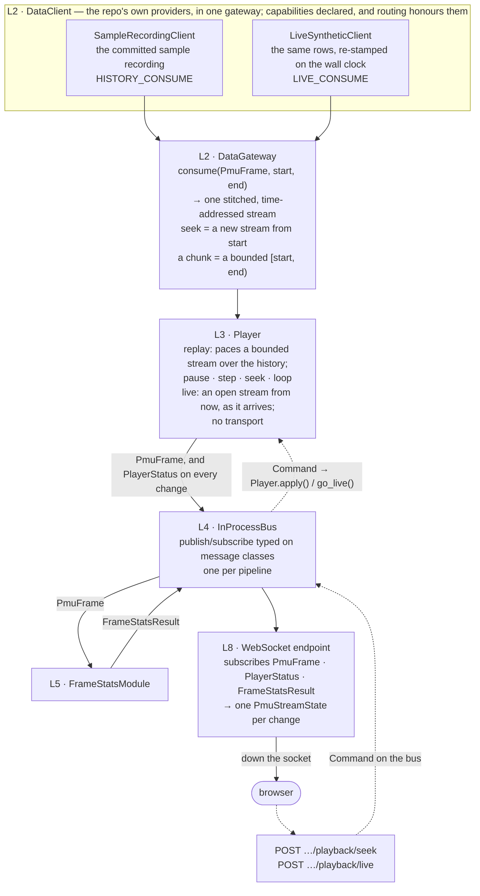
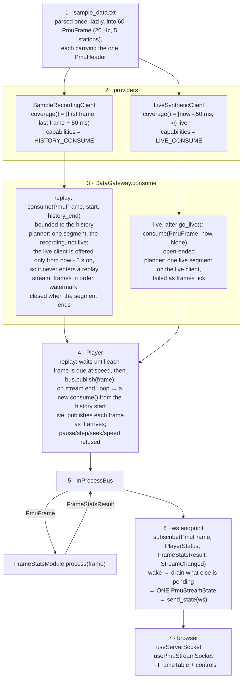
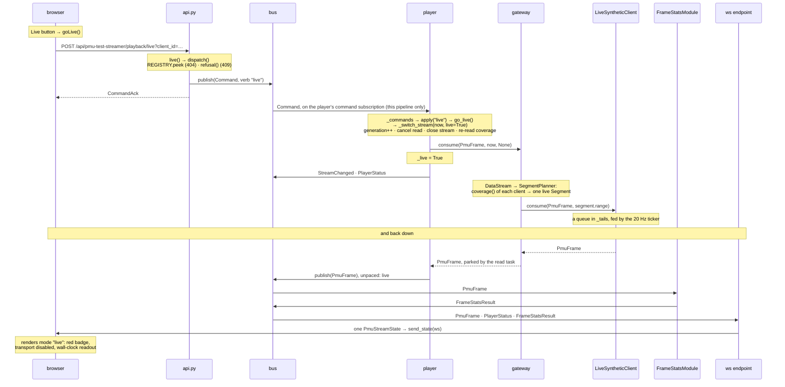
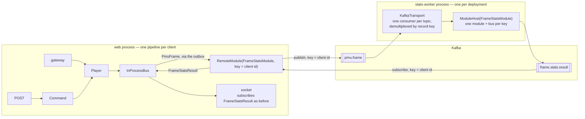
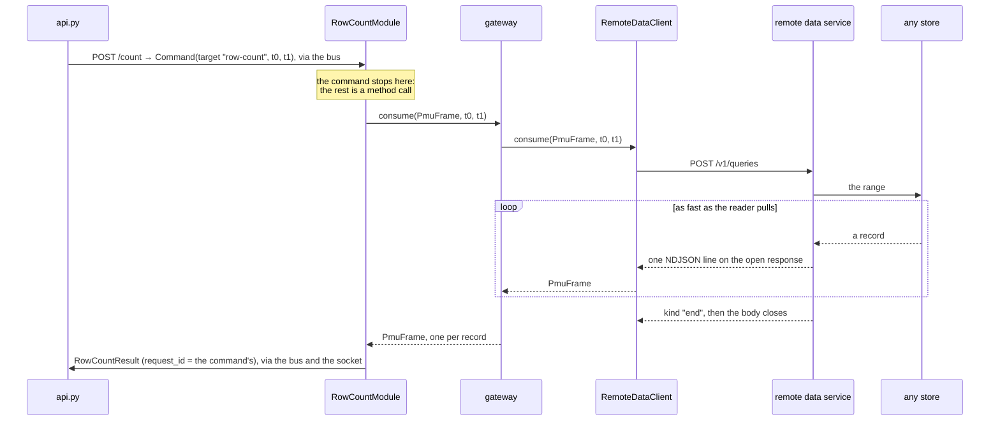

# The server data architecture

How PMU data moves from a data source to a browser in the p-SWAMP server, and
what each piece on the way is for. The PMU test streamer was its first slice;
the last section lists what is still open.

The code is the `pswamp_core` package under `core/`. Its only dependency is
pydantic, plus aiokafka behind the `kafka` extra and httpx behind
`remote-data`. The PMU test streamer (`app/server-python/src/pmu_test_streamer/`,
route `/pmu-test-streamer`) is the worked example of every piece and the source
of the snippets below. "Adding things" is the recipe for your own module and
its page; "Running a module as a separate service" explains that recipe's
optional last step.

**The building blocks** are described from the data outward -- provider,
gateway, player, bus, module, pipeline, edge -- since each depends on the one
before. **The worked example** ("What happens when you click Live") runs the
other way, from the browser button up to the data clients, since that is how a
request travels.

## The layers

The core is a stack of eight layers, numbered from the bottom; the `L` numbers
below refer to it. **Each layer imports only the ones below it.** That is what
lets a provider be written outside the repo against L1 and L2 alone, and a
module move to another process without touching its neighbours.

| | Layer | What it is | Where |
|---|---|---|---|
| L1 | Messages | The wire models: `DataModel` and every message derived from it -- `PmuFrame` (carrying its `PmuHeader`), `Command`, `PlayerStatus`, `ResultEnvelope`, `ErrorEvent`. pydantic only; what every arrow carries | `messages/` |
| L2 | Gateway | The provider contract (`DataClient`, its capabilities) and the `DataGateway` that stitches providers into one time-addressed stream | `datagateway/` |
| L3 | Player | Paces a gateway stream and owns the transport controls: play, pause, step, seek, speed, replay, live | `datagateway/player.py` |
| L4 | Bus | In-process publish/subscribe typed on message classes; one per pipeline | `bus/` |
| L5 | Modules | Analysis: consume one message class off the bus, publish another | `modules.py`, `remote.py` |
| L6 | Pipeline | One stream's gateway, player, bus and modules as a unit, and the registry that keeps one per key | `pipeline.py` |
| L7 | Hosting | Which process each piece runs in, from the environment: providers and transports by name, a module as its own service | `transport/`, `datagateway/config.py`, `remote.main` |
| L8 | Web edge | The app package: POSTs that become commands, the socket that pushes state | `app/server-python/src/<app>/` |

Not every layer is a hop: L1 is the vocabulary of the others, L6 the box
around L2–L5, L7 deployment. The pictures below follow a frame and a command,
so they show only L2–L5 and L8.

## The idea in one picture



**Every arrow carries a pydantic model** (`PmuFrame`, `PlayerStatus`,
`Command`, …) -- that is L1: JSON with a schema version end to end, and the
browser's TypeScript types are generated from the same classes. **Nothing
above the bus knows what is below it**: the endpoint and the module subscribe
to message classes, the player writes to the bus. Swapping a provider (top
row) changes nothing else; a deployment's own provider -- a TSO's remote data
service, a broker feed -- takes the place of either one shown.

**L5 is the one box that can leave the process.** In the compose and minikube
stacks it does -- the module runs in the `stats-worker` container, reached over
Kafka -- and nothing else in the picture changes (see "Running a module as a
separate service").

## The building blocks

### Messages — `pswamp_core.messages`

*What.* Every message that crosses a topic, a socket or a process boundary is a
`DataModel`: a pydantic model with a schema `version` (pinned per subclass), an
`mRID` identity, a UTC `timestamp`, and a **topic derived from the class name**.

```python
from typing import Literal
from pswamp_core.messages import DataModel

class LineTrip(DataModel):            # topic: "line.trip"
    version: Literal["v1"] = "v1"
    timestamp: datetime               # required: the event's own time
    line: str

LineTrip.topic                        # "line.trip"
LineTrip.model_validate_json(text)    # the whole codec; a "v2" payload fails here
```

*Why.* No pickle and no numpy on the wire means a message can be logged,
inspected, validated on receipt, and published into the browser contract
without an adapter. The set of `DataModel` subclasses *is* the topic catalogue,
with the schema attached to each entry.

*Where.* `core/src/pswamp_core/messages/`: `data_model.py` (the base),
`pmu.py` (measurements), `results.py` (what modules emit), `control.py`
(commands and player state).

The measurement shape is **one instant of every channel, carrying its layout**:

```python
PmuFrame    # per instant: timestamp, mRID, header, values: list[float | None]  (NaN is null on the wire)
PmuHeader   # nested in every frame: station / channel / measurement / units per column, data_rate;
            # header_id is a content hash, computed and cached, so a consumer can spot a change cheaply
```

`PmuHeader` is the config-frame analogue; `header.columns(measurement="f")`
is the query p-SWAMP's applications already make of a labelled window. It
rides inside every frame: ~1 KB repeated per frame for the sample (about 3.4x
a bare frame, ~1.2x once a broker's batch compression collapses the repeats).
In return any single frame is enough to work from: a module reads the layout
off the frame it is processing, a late-starting worker is primed by its first
input, a live source describes itself, and a changed layout is simply the next
frame's header. The measurement is in the docstring of `messages/pmu.py`.

### Providers — `pswamp_core.datagateway.DataClient`

*What.* The contract a data source implements. Three abstract methods and a
declaration of what the source can do:

```python
from pswamp_core.datagateway import Capability, Coverage, DataClient, TimeRange

class SampleRecordingClient(DataClient):
    capabilities = Capability.HISTORY_CONSUME          # a file cannot tail live data

    async def coverage(self, model, mRID=None) -> Coverage | None:
        return Coverage(TimeRange(first_frame.timestamp, last_frame.timestamp + interval))

    async def consume(self, model, time_range, mRID=None):   # an async iterator
        for frame in self.frames:
            if time_range.contains(frame.timestamp):
                yield frame

    async def produce(self, data): raise TypeError("read-only")
```

*Why.* Capabilities replace the old nine-method duck type, where half the
`seek` implementations were `pass`. The core never asks a provider for what it
did not declare, and the planner enforces it: a history segment goes only
to a `HISTORY_CONSUME` client, the live hand-off only to a `LIVE_CONSUME` one,
and a client that can only tail is offered only from the hand-off margin on.
`coverage` is re-asked on every call because most real stores have now-relative
windows. **History lives with the provider** — the repo persists nothing; a
TSO's store, behind its remote data service, is a `DataClient`, and that is how
"no database in the repo" and "navigate history" coexist.

*Where.* The contract: `core/src/pswamp_core/datagateway/data_client_model.py`.
The reference client (`InMemoryClient`): `datagateway/clients/in_memory.py`. Two
providers written *outside* the core, as a TSO's would be, both under
`app/server-python/src/pmu_test_streamer/`: `sample_client.py` (the recording:
history) and `live_client.py` (a synthetic live feed: `LIVE_CONSUME` only, the
recording's rows re-stamped on the wall clock at 20 Hz). Both serve only
`PmuFrame`, and since each frame carries its layout, either alone is enough
for a page to render a table.

A provider proves itself with the **conformance suite** — inherit it, supply
three fixtures. The cases follow the declared capabilities: the history cases
skip for a tail-only client, whose `conformance_records` is `[]`, and the live
cases skip for a history-only one:

```python
from pswamp_core.datagateway.conformance import DataClientConformance

class TestMyClient(DataClientConformance):
    @pytest.fixture
    def client_under_test(self): return MyClient("mine")
    @pytest.fixture
    def conformance_model(self): return PmuFrame
    @pytest.fixture
    def conformance_records(self, client_under_test): return list(client_under_test.frames)
```

A provider is **chosen and configured from the environment**, never in code:

```
PSWAMP_DATA_CLIENTS="live:acme_tso.pmu:KafkaFeed,history:acme_tso.pmu:TimescaleClient"
HISTORY_DSN=postgres://…          # each client reads its own {NAME}_{SETTING} block
```

The local k8s manifest (`k8s/p-swamp-local.yaml`) is the worked example, with
the repo's own providers: it names both in `PSWAMP_DATA_CLIENTS` and points
`LIVE_PATH` at a ConfigMap-mounted file
(`k8s/deployment_pmu_data_file_example.txt`, every value counting up by one per
frame), so the live feed visibly comes from outside the image.

```python
gateway = gateway_from_env(
    default="sample:pmu_test_streamer.sample_client:SampleRecordingClient,"
            "live:pmu_test_streamer.live_client:LiveSyntheticClient"
)
MyClient.show_config("history")   # prints the variables a deployment must set
```

### The gateway — `pswamp_core.datagateway.DataGateway`

*What.* One object over any number of providers, with two verbs:

```python
gateway.consume(PmuFrame, start=t0, end=None)    # a seek: from t0, onwards
gateway.consume(PmuFrame, start=t0, end=t1)      # a chunk: exactly [t0, t1)
await gateway.produce(message)                   # to every client that can store it
```

*Why.* "Jump to a time" and "query a chunk" are the same call, which is why they
are provider capabilities and not bus features. Behind `consume`, a
`SegmentPlanner` picks, one segment at a time, whichever client covers the
cursor (highest priority wins, coverage re-asked at every boundary), and a
`DataStream` stitches the segments into one iterator with a watermark that
drops duplicates across overlapping sources. A history store can carry a replay
right up to now and hand over to a live source only then. This layer is Louis
Pauchet's `test_pswamp` draft, lifted.

*Where.* `datagateway/data_gateway.py`, `planner.py`, `stream.py`,
`time_range.py`.

### The player — `pswamp_core.datagateway.Player`

*What.* Paces a gateway stream and owns the replay controls.

```python
player = Player(gateway, bus, model=PmuFrame, speed=1.0, loop=True)
await player.start()          # opens gateway.consume(PmuFrame, start, history_end); paused
player.resume(); player.pause(); player.set_speed(2.0)
await player.step(-1)         # one frame back
await player.seek(t)          # a NEW stream from t, announced as StreamChanged
await player.go_live()        # a NEW, open-ended stream from now; mode "live"
await player.replay()         # back to the recording's start, paused; mode "replay"
await player.replay(t0, t1)   # a BOUNDED replay of [t0, t1): ends paused at t1, never loops
player.status()               # PlayerStatus: mode, cursor, speed, paused, can_seek, can_go_live, coverage, range_end, error…
```

A bounded replay (the `replay` verb with `end`, and `play: true` to start it)
ends paused at `end` even on a looping player. A provider that raises mid-stream
-- or whose coverage call fails, at start or later -- ends the stream paused
with `PlayerStatus.error` set to the client's own error and an `ErrorEvent` on
the bus naming that client; the pipeline still starts, so the page connects and
shows why. The `refresh` verb asks the gateway again; a play or seek that finds
the source clears the error.

*Why.* The gateway yields as fast as the provider reads; a human watching a
disturbance needs real time, and needs to scrub. The decisions made here, once:

- **Seek is a new stream** -- a stream's watermark rightly refuses to go
  backwards.
- **Mode is which stream is open.** A *replay* is a bounded stream over the
  history coverage, paced, looping at its end; *live* is an open-ended stream
  from now, delivered as it arrives, with no transport controls. Nothing
  switches on its own: an archive beside a live feed replays paced and
  seekable (`can_seek`) and offers the switch (`can_go_live`), so a page
  renders no dead buttons.
- **Pacing drops time rather than bursting** when the loop falls behind.
- **Commands come from the bus** (below), so a POST, a test and a future Qt
  widget drive the player the same way.
- **The next-frame read is a task awaited outside the lock** (learned the hard
  way), so a live feed gone quiet never blocks the switch back to replay.

*Where.* `datagateway/player.py`.

### The bus — `pswamp_core.bus.InProcessBus`

*What.* Publish/subscribe inside one process, typed on message classes. A
subscription to a base class receives every subclass.

```python
bus = InProcessBus()
with bus.subscribe(PmuFrame, PlayerStatus, overflow=Overflow.DROP_OLDEST, maxsize=64) as sub:
    async for message in sub: ...
bus.add_listener(ResultEnvelope, store.remember)   # synchronous, every message, in order
bus.publish(frame)                                  # from the loop
bus.publish_threadsafe(result)                      # from a thread: the ONE crossing point
```

*Why.* It is what decouples the player from the endpoint and the module from
both. The overflow policy is per subscription because a live stream and a
completeness-first replay want different answers to "the consumer is slow":
`DROP_OLDEST` for frames, `LATEST_ONLY` for state, `GROW` for commands.
`publish_threadsafe` is the seam through which the desktop package's blocking
application threads will publish when they are bridged in; it exists now so a
second mechanism never appears.

*Why not the gateway alone.* They answer different questions. The gateway
answers "where do the records for this time range come from?" -- a pull, one
reader, facing the source. The bus answers "who needs this message now?" -- a
push, many readers, facing the consumers. The player pulls from one and
publishes onto the other. A page needs the bus side:

- Each frame has several readers (the module, the socket, `Latest`) where a
  `DataStream` has one; a `consume()` per reader would mean a stream and a
  clock each, and a seek that has to find them all.
- Much of the traffic is not source data: results, `PlayerStatus` and
  `ErrorEvent` originate inside the pipeline, and a `Command` travels the
  other way, from a POST to the player or a module.
- Overflow is per reader, so a slow browser tab drops its own frames and never
  stalls the analysis.

The bus is what keeps every provider single-consumer. A broker cannot stand in
for it, since a time-addressed stream drops the timestamps a replay sends
backwards (see "Running a module as a separate service"). A broker's place is
behind the bus, as the *transport* to a module that has left the process,
reached through a `RemoteModule`, so the page never notices the move.

*Where.* `core/src/pswamp_core/bus/__init__.py`. `Latest` in the same module
keeps the newest message per class — what a freshly connected socket renders
from.

### Modules — `pswamp_core.modules.Module`

*What.* Consume one message class, publish another.

```python
class FrameStats(BaseModel): mean_frequency_hz: float | None; ...
class FrameStatsResult(ResultEnvelope[FrameStats]):     # topic: frame.stats.result
    version: Literal["v1"] = "v1"

class FrameStatsModule(Module):
    name = "frame-stats"
    input_model = PmuFrame
    output_model = FrameStatsResult
    async def process(self, frame: PmuFrame) -> FrameStats | None:
        ...
```

*Why.* A contributor's module is the analysis and two class attributes; `run`
subscribes, calls, wraps in the envelope (`timestamp`, `app` identity,
`parameters`, `request_id`) and publishes. The page that shows it subscribes to
`FrameStatsResult`, never to the module. This is the coroutine module; the
desktop package's thread-based `SnapshotApp`s are bridged to the same bus and
the same envelope when `GatewayIO` lands (deferred; see the last section).

*Where.* `core/src/pswamp_core/modules.py`;
`app/server-python/src/pmu_test_streamer/stats_module.py` (a module that
*reduces* a frame; it derives its column indexes from `frame.header` on the
first frame and again whenever a frame's `header_id` differs, so it has no
`setup`, and the same instance runs unchanged in another process).

### Pipeline and registry — `pswamp_core.pipeline`

*What.* One stream's gateway, bus, player and modules, and the registry that
builds one per key, caps them and evicts them.

```python
async def build_pipeline(client_id: str) -> Pipeline:
    gateway = gateway_from_env(DEFAULT_DATA_CLIENTS)
    bus = InProcessBus()
    return Pipeline(client_id, gateway, bus, Player(gateway, bus, loop=True), [FrameStatsModule()])

REGISTRY = PipelineRegistry(build_pipeline, max_pipelines=8, idle_seconds=300)
pipeline = await REGISTRY.acquire(client_id)   # builds on first connect; one per key
REGISTRY.peek(client_id)                       # a command's view: never builds
```

*Why.* The key is the unit of isolation, and **everything inside a pipeline is
built fresh for its key**: the factory runs once per key, so each gets its own
gateway (and client instances), bus, player and modules. A **replay is keyed
per client**: a visitor exploring
recorded data wants their own clock. A **live stream would be keyed per
stream**: every operator sees the same instant and the analysis runs once.
Same class, different key. The registry is the grid monitor's `HubRegistry`
moved down and generalised: per-key lock so five simultaneous sockets build one
pipeline, idle grace so a reload rejoins, LRU eviction at the cap, refusal when
nothing is reclaimable. See "What is per client, what is shared" below.

*Where.* `core/src/pswamp_core/pipeline.py`.

### The web edge — the app package

*What.* What is left in `pmu_test_streamer/api.py` once the core does the rest:
which messages to forward down the socket, and which POSTs become which
`Command`. The browser contract is unchanged: commands up as `POST`, state
down one socket, an acknowledgement that never carries state, everything
generated into `doc/api/openapi.json`.

*Where.* `app/server-python/src/pmu_test_streamer/api.py`; the page in
`app/client-web/src/pages/pmu-test-streamer/`. The push loop a page needs is
the grid monitor's, `event_queue` + `serve_updates` in `pswamp_web/pump.py`
(re-exported by `shared.py`), which serves a core pipeline unchanged. The
client-id handshake is not yet shared; see "Adding things".

## How data flows: source to browser



Step 6 coalesces: each message is the frame at the cursor (with its layout
inside), the player's status and the latest module result. A slow socket sees
the newest state, never a backlog. The page keeps the last layout it saw, so
the table stays laid out while no frame is at the cursor (a replay paused at
its start after a stream switch).

## What happens when you click Live: the chain, walked from the browser up

One command on the PMU test streamer, step by step, naming the code at each.
"Live" changes the most; the other seven (`replay`, `play`, `stop`, `forward`,
`back`, `seek`, `speed`) take the same path and differ only in what the player
does at step 6.

**1. The button.** `PmuTestStreamerPage.tsx` renders the Recorded | Live switch
from the last `PmuStreamState` it received: `Live` is enabled when
`player.can_go_live` is true and pressed when `player.mode === "live"`. Its
`onClick` calls `goLive()` from the page's own hook, and only when the page is
not already live -- the page never fires a command that would change nothing.

**2. The hook.** `usePmuStreamSocket.ts` has one `useCallback` per command.
`goLive` is `fireCommand('pmu-test-streamer', postCommand('/api/pmu-test-streamer/playback/live'))`.
`postCommand` (`src/lib/commands.ts`) is typed against the generated
`schema.ts`, so a wrong path is a `tsc` error; it appends `?client_id=` from
`src/lib/clientId.ts` (one id per browser profile, in `localStorage`) and
resolves the url against the serving origin (`src/lib/servers.ts`). Under Vite
that is the dev server, whose `/api` proxy forwards to the compose server; in
the image it is the server itself. `fireCommand` awaits the POST and logs a
failure. Nothing on the page waits for the reply: the effect arrives on the
socket like any other change.

**3. The route.** `server.py` mounts the streamer's `router` under
`/api/pmu-test-streamer`. The handler `live()` in `pmu_test_streamer/api.py` is
one line: `return await dispatch(client_id, "live")`.

**4. Dispatch: find, check, publish, acknowledge.** `dispatch()` in `api.py`:

- `live_pipeline(client_id)` asks `REGISTRY.peek()` for this client's pipeline.
  A command never *builds* one -- no page open, no pipeline, 404.
- `refusal(pipeline.player.status(), "live")` asks whether the player's current
  mode can apply the verb. `live` without a live source, or any transport verb
  while live, is a **409** with the reason, and nothing is published.
- Otherwise it builds a `Command(client_id=…, verb="live", args={})` -- which
  generates a `request_id` -- publishes it on **that pipeline's bus**, logs it
  with the roster, and returns `CommandAck(applied="live")`. The ack means
  *dispatched*: the player has not run yet.

**5. The bus.** `InProcessBus.publish` delivers the `Command` synchronously to
every subscription whose class matches. The only subscriber to `Command` is
the player's command task, subscribed with `Overflow.GROW` so no command is
ever dropped. The bus is per pipeline, so the command reaches this client's
player and no other.

**6. The player applies it.** `Player._commands` (`core/…/datagateway/player.py`)
reads the command off its subscription and calls `apply()`, which maps the
verb: `live` → `go_live()`, `replay` → `replay()`, `play` → `resume()`, and so
on. A `PlayerError` here (a refusal the edge's check could not see) is logged
and dropped.

**7. The switch.** `go_live()` takes the player's lock and calls
`_switch_stream(utcnow(), live=True)`; `replay()` calls
`_switch_stream(history_start, live=False)`. This is the one place a stream is
replaced, and it does five things in order: bump the generation (so a frame the
run loop had parked from the old stream is discarded); cancel the read task in
flight on the old stream; close the old `DataStream`; re-read what the gateway
offers (`coverage(model, capability=HISTORY_CONSUME)` for the seekable range,
`supports(model, LIVE_CONSUME)` for whether live exists); and open the new one
with `gateway.consume(model, start, end)` -- `end` is the history's end for a
replay, so it runs out and loops, and `None` for live, so it never ends. Then it
sets the `_live` flag, which is what `mode` reports, and publishes
`StreamChanged`. Back in `go_live()` the player unpauses (live has no pause);
in `replay()` it pauses (the same state the page opens in). Both publish a
`PlayerStatus`.

**8. The gateway plans a segment.** `gateway.consume()` returned a `DataStream`
without touching any client; the player's next read (a task, awaited outside
the lock) is what drives it. `DataStream._iterate` asks `SegmentPlanner.next_segment`
for the segment at the cursor. The planner calls `coverage()` on every
consuming client and keeps the offers that contain the cursor, honouring what
each client declared:

- `SampleRecordingClient.coverage()` is the fixed window
  `[2026-01-01 00:00:00.050, +3.0 s)`; a `HISTORY_CONSUME` client, so it may
  serve a history segment.
- `LiveSyntheticClient.coverage()` is `[now - 50 ms, ∞) live`; a `LIVE_CONSUME`
  -only client, so it is *offered* only from `now - 5 s` (the hand-off margin)
  on, and *eligible* only for the live hand-off.

For **live**, the cursor is `now`: only the live client covers it, the hand-off
applies, and the planner returns one open-ended live `Segment` on it. For
**replay**, the cursor is the recording's first instant: only the recording
covers it, and the planner returns one history `Segment` bounded to the
recording's end. The two clients never compete, and neither is ever asked for
what it did not declare.

**9. The data client serves it.** The stream calls the chosen client's
`consume(PmuFrame, segment.range)`:

- `LiveSyntheticClient.consume` registers an `asyncio.Queue` in its `_tails`
  and yields whatever the ticker puts there. The ticker has been running since
  `Pipeline.start` called `gateway.open()`; every 50 ms it takes the next row of
  the recording, stamps it `utcnow()`, and puts it on every tailing queue. The
  queue is removed in `finally`, so a switch away stops the delivery.
- `SampleRecordingClient.consume` iterates its sixty parsed frames and yields
  those inside the range. The frames were parsed once, lazily, from
  `sample_data.txt`, and each carries the recording's header.

That is the top of the chain. From here everything runs **back down**, and it
is the same path for both sources: the read task parks the frame; the run loop
paces it (replay) or passes it straight through (live) and `bus.publish`es it;
`FrameStatsModule` and the socket's subscription both receive it;
`FrameStatsModule` publishes a `FrameStatsResult`; the endpoint's push task
wakes, drains what else is pending, builds one `PmuStreamState` from the
player's status and the bus's latest frame and result, and `send_state`s it.
The page renders that message -- the badge turns red, the transport row
disables, the readout shows a wall-clock time -- because the *server* said the
mode is live, not because a button was pressed.



The command carries a `request_id`, generated on the server and logged with
the verb; a module answering a command copies it onto its `ResultEnvelope`, so a
result on a shared bus can be routed back to the client that asked. (Returning
it to the browser in the acknowledgement is the one edge change still pending;
see the last section.)

## What is per client, what is shared

| | in the streamer today (per client, replay or live) | for a shared live feed (designed, not yet built) |
|---|---|---|
| pipeline key | the browser's client id | the stream name |
| provider | the recording plus the synthetic live feed, opened per pipeline | the deployment's live and history clients |
| player | one per client: own cursor, own speed, own recorded/live switch; live has no transport | one per stream, always live; "pause" is view state |
| modules | run once per pipeline | run once per stream, results shared |
| bus | one per pipeline | one per stream |
| socket | one per page per client | one per page per client, subscribed to the shared bus |

### One gateway per client, concretely

"One pipeline per client" is easy to read as one *player* per client over
shared plumbing. It is not: the gateway and its data clients are per client
too. On a new client id the registry calls `build_pipeline(client_id)`, whose
`gateway_from_env(...)` **instantiates the clients named in the spec** -- a new
`SampleRecordingClient` and `LiveSyntheticClient` -- in a new `DataGateway`.
`Pipeline.start` then calls `gateway.open()`, which starts this client's live
ticker. Eight browsers in live mode are eight tickers; evicting a pipeline
calls `gateway.close()` and stops one.

Only one thing is shared across pipelines: the **parsed recording**.
`load_sample()` is `lru_cache`d by path, so the sixty frames (and the one
header they all point at) are read from `sample_data.txt` once per process, and
every `SampleRecordingClient` holds the same frozen objects. That is safe
because nothing writes to them; the live client copies each row's `values`
before stamping it. (The registry and the event loop are shared too, of
course.)

Why not one gateway for all clients, with a player each? Because the gateway
holds the *provider's* state, and that is per consumer as soon as anything
tails: a live client holds a queue per open `consume()`, a broker client would
hold a subscription per consumer, a database client a cursor. The `DataClient`
contract has no consumer identity, on purpose, so a provider stays simple to
write; keeping the gateway inside the pipeline keeps every provider
single-consumer.

The cost is what the registry caps. A streamer pipeline is a handful of
`asyncio` tasks (the player's run, command and read tasks, one per module, the
live ticker) and the objects above -- no threads, no copies of the recording --
so it is cheap next to the grid monitor's four-thread hubs. `MAX_PIPELINES` and
`IDLE_EVICT_SECONDS` in `api.py` are the bounds, pinned by the registry's
tests. Every socket a browser opens carries the same `client_id`, so all its
pages land on one pipeline; another browser is another pipeline, which is why
two browsers in recorded mode can sit at different frames, and two in live
mode -- with this synthetic feed -- see different ticks.

That is the honest limit. The streamer's live feed is per client because the
gateway is: right for a synthetic source, wrong for a real one, where every
viewer must see the same instant and the analysis must run once. The answer is
the table's right-hand column -- one pipeline keyed by the *stream*, its
gateway and live client shared by every viewer, with only replay cursors and
view state per client. It is still a design.

## Adding things

**A provider** (a TSO's data source, or a new recording format): implement
`DataClient` in your own package, importing `pswamp_core.datagateway` and
`pswamp_core.messages` only; declare `env_settings`; inherit
`DataClientConformance` in a test with your three fixtures; name the class in
`PSWAMP_DATA_CLIENTS`. Nothing in this repo changes. `sample_client.py` is the
model.

**A module, and the page that shows it**: one app package with its own
pipeline. The streamer is that shape with more in it, so each step names the
piece of `pmu_test_streamer/` to copy.

1. `./scripts/generate-new-subapp.sh my-thing "My Thing"` for the folders and
   the four registry entries; replace the counter it writes, delete its
   `model.py` (and the `*_API_PATH` const if the page has no commands).
2. **The module**, in its own file: a pydantic result body, the envelope
   (`class MyThingResult(ResultEnvelope[MyThingBody])`, topic `my.thing.result`),
   and a `Module` subclass with `name`, `input_model`, `output_model` and
   `process`. Read the layout off `frame.header` when it matters, re-deriving
   on a changed `header_id` (`stats_module.py` does); `setup` only for
   something a module needs from the gateway itself (`row_count_module.py`
   keeps the gateway). Import only `pswamp_core`.
3. **The pipeline**, copied from the streamer's `build_pipeline`, `REGISTRY`
   and `lifespan`. The module list there is the only registry a module has.
   Name the provider in the `gateway_from_env` spec string and give the app its
   own `variable=`; don't import `pmu_test_streamer`. A page with no transport
   wants `Player(..., autoplay=True, loop=True)`, or it shows dashes for ever.
4. **The socket**: a state model exported as `WS_MESSAGE`, carrying the
   envelope as it is (and the frame at the cursor, if the page shows one --
   its layout comes inside it); `state_message` reading
   `pipeline.latest.get(MyThingResult)`; and the grid monitor's push loop
   from `shared.py`, which serves a core bus unchanged:

   ```python
   with event_queue(pipeline.bus, MyThingResult) as updates:
       await serve_updates(ws, updates, lambda event: state_message(pipeline))
   ```

   Open the queue before building the opening message. The handshake around
   it (`read_client_id`, `accept`, `REGISTRY.acquire`, 1013 on
   `CapacityError`, `release`) is not shared yet -- copy the streamer's
   `connected_pipeline` and point it at your registry.
5. **Commands**, if any: `POST`s that `REGISTRY.peek` (404 if none) and
   `bus.publish(Command(...))`; `dispatch` in the streamer is the model.
6. **The page**: `useServerSocket<Wire['MyThingState']>(MY_THING_WS_PATH)`;
   the component reads the module's fields as written.
7. `generate-api-contract.sh`, `error_check.sh`,
   `run-python-server-tests.sh`; restart the server script (a new package
   needs the rebuild). Tests: call `process` directly, and run the pipeline
   with `player.paced = False` reading the bus.
8. **Optional: run the module as its own service.** In-process is the default
   and costs nothing; if you need this, four edits, none to the module (its
   input carries everything it needs, as `stats_module.py` shows):
   - `build_pipeline`: `RemoteModule(MyThingModule, transport, key)` where
     `MyThingModule()` was, with the transport from
     `transport_from_env("MY_THING_MODULE_TRANSPORT")` built once per process
     and closed in `lifespan` (`stats_modules` / `module_transport` in the
     streamer's `api.py`); unset, the list holds the module itself;
   - `worker.py`: `raise SystemExit(main(MyThingModule, "MY_THING_MODULE_TRANSPORT"))`
     from `pswamp_core.remote`;
   - the variable on both sides in compose and `k8s/`, and a worker service
     that is the same image with that command (copy `stats-worker`);
   - a test running `ModuleHost(MyThingModule, broker)` beside the pipeline
     over `InMemoryTransport` (copy the streamer's).

**If the new module publishes a new data shape/type.** Nothing in `core/`
changes: the bus, `Latest`, the gateway and the player are all typed on
whatever `DataModel` subclass you hand them (the core's own tests run the
chain on a non-PMU `Measurement`). What has to be done:

- **Declare it once, as a `DataModel` subclass, where every consumer can
  import it.** The class *is* the type and the topic -- the bus routes by
  `isinstance`, so the module and whatever reads its output must import the
  same class, not two look-alikes. Consumed only inside the app package: beside
  the module, as `FrameStatsResult` is in `stats_module.py`. Consumed by
  another app package, a provider outside the repo, or the desktop package:
  in `core/src/pswamp_core/messages/`, so importing it needs nothing but the
  core. Never import another app package to get at its types.
- Pin `version: Literal["v1"]`; give it a `timestamp` if a player will pace it
  or an envelope will carry it.
- A module's output is always `ResultEnvelope[YourBody]`; the payload sits
  under `.result`, and a downstream module subscribes to the envelope class.
  A stage that must publish a *bare* message (a cleaned `PmuFrame` for the
  existing PMU modules to consume as if from a source) has no `Module` path
  today: it needs its own `run` calling `bus.publish`, or a decision to give
  `Module` one.
- If the type is an *input* rather than a result, something has to serve it:
  a provider answering `coverage`/`consume` for that class, and a
  `Player(model=YourType)` in the pipeline. One player streams one class.
- A `PmuHeader` is the PMU stream's layout, not the core's: a new type has no
  header unless you nest one in it, as `PmuFrame` does, and the page sends
  what it needs.
- Regenerate the contract; the browser type follows from the state model.

Don't add the module to the *streamer's* pipeline and put the page in
another package: two apps sharing a pipeline is the right-hand column of the
table above, a decision about the key, not a shortcut.

## Running a module as a separate service

*What.* The module's slot in the pipeline's module list is taken by a stand-in
that carries the module's input class out to a broker topic and its result
class back; a worker process runs the real module, one instance per pipeline
key. Nothing in the module changes, and nothing above the bus notices.



`RemoteModule(FrameStatsModule, transport, key)` has the module's `name`,
`input_model` and `output_model`. Its `run` drains the input class off the
local bus onto its topic (a `DROP_OLDEST` subscription, so a slow broker costs
frames, not memory) and publishes what arrives on the result topic back onto
the bus. `ModuleHost(FrameStatsModule,
transport)` subscribes to the input topic across every key; the first input for
a key builds that key's bus, module and forwarder, and a key idle for
`idle_seconds` is evicted. One variable, read by both sides, is the whole
switch:

```
PMU_TEST_STREAMER_MODULE_TRANSPORT=kafka:pswamp_core.transport.kafka:KafkaTransport
KAFKA_BOOTSTRAP_SERVERS=kafka:9092                # KAFKA_TOPIC_PREFIX optional
```

Unset, the module runs in-process; `mem:pswamp_core.transport:InMemoryTransport`
is the portless value every test uses. Compose runs `kafka` (the Apache image,
one KRaft node, no volume), the server and `stats-worker`; `k8s/` has the
matching three Deployments; the smoke test plays the streamer and waits for the
module's result either way.

*Why.* Three decisions:

- **The hop is a transport, not a provider.** An earlier sketch had the broker
  as a bus via `gateway.produce`/`consume`. The streamer's replay frames are stamped
  in January and go *backwards* at every loop; a time-addressed `DataStream`
  would drop them. A `Transport` carries what the bus said, in order, and
  never reads a timestamp. A broker as a *source* is still a `DataClient`.
- **The pipeline key is the record key.** One topic per class, never per
  client, so eight pipelines are three topics and the worker tells them apart
  by key. No `DataModel` gains a field (ADR-005), and the streamer stays per
  client with every command intact, since the player never leaves the server.
- **The input is all the worker needs.** A frame carries its layout, so a
  worker that starts late -- or a key that was evicted and rebuilt -- is primed
  by the first frame it sees, and a changed layout is just the next frame. The
  price is the layout repeated in every record, about 1.2x on the wire once
  the broker's batch compression has collapsed it.

This landed ahead of the measurements the design asked for before adding a
broker; the numbers to produce next are listed in the last section.

*Where.* `core/src/pswamp_core/transport/` (`Transport`, `InMemoryTransport`,
`transport_from_env`; `kafka.py`), `core/src/pswamp_core/remote.py`
(`RemoteModule`, `ModuleHost`, `main`); the streamer's `stats_modules`,
`module_transport` and `worker.py`; `kafka` and `stats-worker` in
`docker-compose.yml` and `k8s/p-swamp-local.yaml`; `core/tests/test_remote.py`
and the last cases of `app/server-python/tests/test_pmu_test_streamer.py`.

## A remote data service as a provider

*What.* `RemoteDataClient` (`datagateway/clients/remote_data.py`,
the `pswamp-core[remote-data]` extra) is a `DataClient` over a deployment's own
remote data service: a small REST api the deployment runs in front of whatever
store holds its history. A range query goes up as `POST /v1/queries`; the
records come back as that call's streamed response, one `RemoteDataResult`
line each (NDJSON), closed by an `end` (or `error`) line; coverage is
`GET /v1/coverage`. **The contract is `doc/remote-data-integration-contract.md`**,
in HTTP terms alone, since the service may be built on any stack;
`scripts/check-remote-data-service.sh` checks a running service against it,
and CI runs it against the stub. Configuration is the `REMOTE_DATA_*` block.



A command never reaches a data client: it stops at the player or a module,
which asks the gateway for a range like anyone else. That keeps the
`DataClient` contract free of commands and of the bus; the `request_id` stays
in the pipeline, and the connection itself is what ties an answer to its
query. Play-range
takes the same path, with `Player.replay(t0, t1)` in the module's place. This
holds only in-process for now: a module hosted in a worker gets an empty
gateway, so the command would reach it but the count would find no provider.
The intended fix is a worker that builds its own gateway from the same
environment, so the command crosses the process as a message and the gateway
call stays a method call (see the last section).

*Why.* Decoupling. p-SWAMP asks for a range and gets it back; which store
answers -- a time-series database, a historian, an archive -- is the
deployment's choice, and it can change that choice without a change here.
The answer comes back on the connection that asked, which is what keeps the
contract small: no correlation id on a line, no second channel to agree on, no
cancel route (closing the connection is the cancel), and backpressure for
free -- the client reads a line only when the player wants the next frame, so a
service writing through socket flow control reads its store at replay speed.
The price is a connection held open for as long as a replay plays, paused
included, which a proxy in between must neither buffer nor cut short. (It was
a Kafka topic at first; the correlation machinery, a consumer per pipeline
decoding every other pipeline's answers, and the unbounded per-query queue
were why it changed.) The dummy service `core/examples/remote_data_stub/` (a
three-second sample tiled to a minute, `python -m remote_data_stub` with
`core/examples` on `PYTHONPATH`) stands in for a
deployment's service in compose and k8s, playing the part of a time-series
store, so the whole path runs from this repo. `/time-series-explorer` drives
it two ways: **play-range** (the player's bounded replay, above) and **count**
(`RowCountModule`, the first `Command` addressed to a module,
`target="row-count"`). The page keeps its time-series name because that is
what is queried on the other end. Open points are in the last section.

*Where.* Everything of the contract is under `core/`: `messages/remote_data.py`
and `datagateway/clients/remote_data.py` in the package; outside it,
`examples/remote_data_stub/` and `examples/check_remote_data_service.py`
(driven by `scripts/check-remote-data-service.sh`). The page is
`time_series_explorer/` in the web backend, and the stub runs as
`remote-data-stub` in `docker-compose.yml` and `k8s/p-swamp-local.yaml`. Tests:
`core/tests/test_remote_data_service.py` runs the conformance suite over the
client wired to the stub in-process (`httpx.ASGITransport`, which buffers the
body, so it proves the contract); `core/tests/test_remote_data_client.py`
pins the lazy pull and cancel-by-closing over a line-by-line body.

## The error topic

*What.* `ErrorEvent` (`messages/errors.py`) is what a pipeline publishes when
something *operational* fails: the player's provider raised, a module's
`process` raised. The bus is per pipeline, so the edge adds one hop: an
`ErrorForwarderModule` per pipeline (`app/server-python/src/errors/`, via
`shared.py`) copies them into a per-client hub tagged with the app's slug, and
`/api/errors/ws` pushes them to the layout's `<ErrorTray>` on every page. Not an
alarm: grid alarms are a correctly running application's result.

*Where.* `messages/errors.py`; `datagateway/player.py` (`_on_stream_error`),
`modules.py`; `app/server-python/src/errors/`; `hooks/useErrorFeed.ts`,
`components/ErrorTray.tsx`.

## Keeping up with a topic

*What.* A module that falls behind its input says so on the error topic.
`Module.run` watches its own input queue with a `KeepUpMonitor`: input the
`DROP_OLDEST` queue discarded, and, for input that crossed a transport, how
long it had been in flight when read (the transport stamps each message with
the broker record's send time, `messages.sent_at()`; not a field, never on the
wire). Past the module's `keep_up` policy -- by default any drop, or input older
than 2 s -- it publishes an `ErrorEvent`: once on falling behind, at most every
5 s while behind, once on catching up. The same check runs on the two queues
either side of a worker hop: the `RemoteModule`'s outbox in the server ("the
server-side publisher … cannot publish"), and the `ModuleHost`'s shared input
feed in the worker. The host now forwards a hosted module's `ErrorEvent`s
under the pipeline key, and the `RemoteModule` puts the ones for its key and
module back on its pipeline's bus, so a failure in the worker reaches the same
tray as one in-process.

*Why.* Dropping stale frames is the right policy for a live stream, and it is
silent. Under load that silence hides exactly the thing an operator needs to
know: the results on screen are computed from a fraction of the data, or from
data seconds old. `/islanding-stream` is where this is exercised: p-SWAMP's
islanding detector as a module, over the N44 line-trip recording (700
channels, 50 Hz), with the replay speed as the load knob. Measured there in
compose, eight clients at real time take about a fifth of a core per side;
the first limit is the server's one event loop, at ~2000–2400 published
41 KB frames a second in total (building, serialising and producing each
frame), while the worker never fell behind. Its topics carry their own prefix
(`ISLANDING_TOPIC_PREFIX`): two apps with the same input class on one broker
would otherwise read each other's frames under the same client key. And every
topic the transport creates has about a minute's retention, enforced every
10 s by the compose and k8s brokers: the broker's defaults let a fast replay
fill the disk.

**A CPU-bound module must leave the event loop.** `/mode-estimation` runs
p-SWAMP's N4SID identification (~0.6 s of CPU per data-second per client) the
same way, and there the analysis is the load. Run on the loop, one
identification stalls every client the worker serves, and the report blames
their input; in a thread or process pool the worker's loop stays at a small
fraction of the work, a client whose identification is still running when the
next falls due skips it (`KeepUpMonitor.note`, "identifications skipped"), and
the capacity limit is the arithmetic of the algorithm. BLAS libraries thread
by default, which inside a pool multiplies the CPU and collapses throughput,
so that worker runs with one BLAS thread per identification.

*Where.* `modules.py` (`KeepUp`, `KeepUpMonitor`), `remote.py`,
`messages/data_model.py` (`sent_at`), the two transports;
`app/server-python/src/islanding_stream/`, `mode_estimation/`;
`islanding-worker` and `mode-estimation-worker` in `docker-compose.yml` and
`k8s/p-swamp-local.yaml`; `core/tests/test_keep_up.py`,
`app/server-python/tests/test_islanding_stream.py`, `test_mode_estimation.py`.

## A CIM reference on the frame

*What.* The gateway stamps every PMU frame with an optional
`PmuHeader.cimReferenceId`: an id for the grid (CIM) data that applies to the
frame. An **enricher** passed to `DataGateway` runs on every payload
`DataStream` yields; `CimReferenceEnricher` decides the reference once per
layout (`reference_for`) and stamps it on every frame with that layout.
Anything later in the pipeline reads it off the frame: the islanding module
returns it with its result. **It is a stub:** `reference_for` returns one
configured placeholder (`ISLANDING_STREAM_CIM_REFERENCE`, or `none`). A
lookup against a CIM model overrides that one method.

*Why.* The gateway is where every reader's frames pass, so stamping there
means every reader sees the same reference, decided once, early. As an
optional field it is additive: providers, player, bus and transport are
untouched, a provider's frame arrives with `None`, old readers ignore it, and
`header_id` (the layout's hash) does not change. It travels with the frame,
so a module in a worker gets it with no configuration of its own. It carries
a reference rather than the grid data itself, which would cost several KB a
frame on every hop.

*Where.* `messages/pmu.py` (`PmuHeader.cimReferenceId`);
`datagateway/enrich.py` (`Enricher`, `CimReferenceEnricher`);
`DataGateway(enrichers=...)`; `app/server-python/src/islanding_stream/api.py`
(the wiring) and the islanding module's `cim_reference_id`;
`core/tests/test_enrich.py`.

## What is deliberately not here yet

Absent from this slice, on purpose:

- the bridge from the desktop package's thread-based `SnapshotApp`s to the bus
  (`GatewayIO`, `AppIO`) and the thread-hosted player that goes with it;
- the grid monitor re-pointed at the core (it still runs the proof-of-concept
  `Hub`/`Bus`/`HubRegistry` in `pswamp_web/`), and so its own hub wired into
  the error topic;
- `request_id` in the browser-facing acknowledgement; batch jobs beyond the
  explorer's row count;
- the draft's CSV provider and a broker *as history* (a topic's retention as a
  time-addressed source; the transport is not one);
- the fixes the first throughput measurements point at: cheaper frames on the
  server (no re-validation of what a provider built, the header serialised
  once per layout), producer batching and a pipelined `RemoteModule` outbox,
  sub-millisecond pacing in the player, keyed partitions, and a per-app topic
  prefix by default rather than by configuration;
- proxy settings for the Remote Data Client's long-lived streamed responses
  (buffering off, idle timeouts past the longest pause), and models beyond
  `PmuFrame` in it; `Module.run` carrying a `Command` natively (the row-count
  module overrides it);
- a `Command` addressed to a module *in the worker* (in-process, the explorer
  has one). The transport already carries the command. What is missing is a
  gateway: `ModuleHost` hands every module `DataGateway([])`, so it would
  need a gateway factory built from the same environment as the pipeline's.
  `RemoteModule` would also need to filter on `target`, since it forwards
  every `Command` on the bus;
- a `PmuFrameAssembler` for deployments that ingest per-PMU messages.
