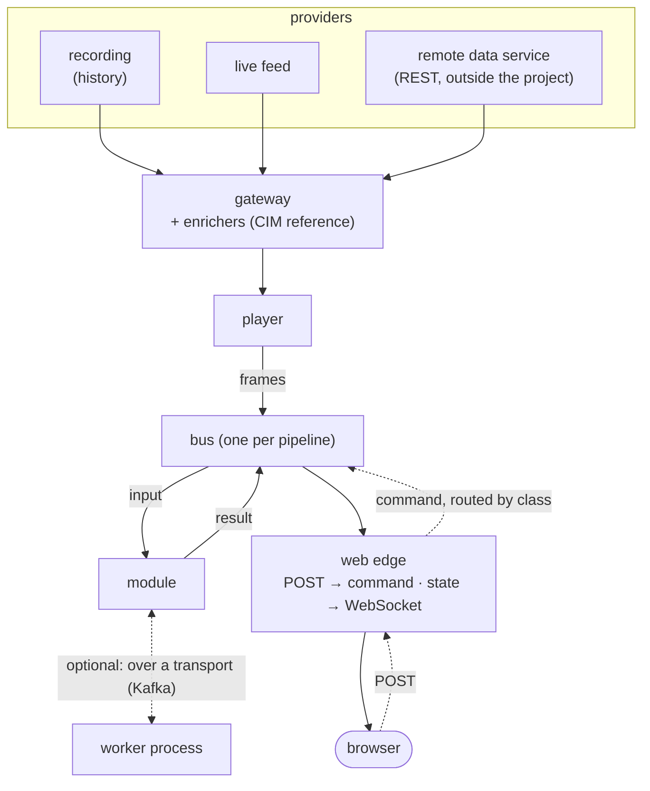

# The server data architecture

How PMU data gets from a data source, through analysis modules, to the web
client, and what each piece on that path is for.

The architecture lives in `core/` as the Python package `pswamp_core`. The web
backend (`app/server-python/`) builds on it. One example runs through this
document and the code: the **PMU test streamer**, a recorded and a live PMU
feed going through one module to one page. Each section below names the code
that implements it.

## What it has to do

| Requirement | Answered by |
|---|---|
| PMU data from several possible sources, processed by swappable modules, delivered to the browser | providers → gateway → player → bus → modules → web edge |
| Adding a module is easy, and its contract (what it receives, what it sends) is explicit | `Module`: one input class, one output class, `process` |
| A heavy module can run as its own process/pod | `RemoteModule` + a worker process, over a transport |
| One place defines the shared pieces and data models | `core/` (`pswamp_core`) |
| Topics go through a transport layer, so Kafka can be swapped out (e.g. for NATS) | `Transport`, with Kafka as the default implementation |
| Pipelines of modules can be defined | `Pipeline`: one gateway, player, bus and module list per key |
| Commands are defined in the core, can be sent upstream, and are picked up by whichever piece declares them | typed `Command` classes, routed by class |
| Runs in compose and in minikube | a worker is the same image with a different command |
| A data source outside the project can be plugged in through a REST contract | `RemoteDataClient` + `doc/remote-data-integration-contract.md` |
| Frames get a reference to the CIM model early, so later modules can look up grid data | gateway enrichers stamp `PmuHeader.cimReferenceId` |
| Live pipelines are shared by every viewer; recorded ones are per client | the pipeline *key*: the stream name for live, the client id for recorded |

## Terms

- **Message**: a pydantic `DataModel`. Everything that crosses a topic, a
  socket or a process is one. The class *is* the topic.
- **PmuFrame**: one instant of every PMU channel. It carries its own layout
  (`PmuHeader`), so any single frame is enough to work from.
- **Command**: a message that asks for something (play, seek, reset). It is
  routed by its class to the one piece that declared it.
- **Provider** (`DataClient`): a data source. It declares what it can do:
  serve history, tail live data.
- **Gateway** (`DataGateway`): a pipeline's providers, at most one for history
  and one for live, behind two reads: `consume` (history) and `tail` (live).
  Enrichers run here.
- **Player**: pulls from the gateway and paces frames onto the bus. It takes
  the replay commands.
- **Bus**: in-process publish/subscribe, typed on message classes. There is one
  bus per pipeline.
- **Transport**: publish/subscribe *between* processes (Kafka, or in-memory for
  tests). A module only ever sees a bus; the transport matters only once a
  module moves out of the process.
- **Module**: analysis. It consumes one message class off the bus and publishes
  another.
- **Worker**: a process that hosts a module for every pipeline that uses it.
- **Pipeline**: one gateway, player, bus and module list, built per *key*.
- **Web edge**: an app package in the web backend. It turns `POST`s into
  commands and pushes state down a WebSocket.

## The picture

```mermaid
flowchart TB
    subgraph sources["providers"]
        direction LR
        rec["recording<br/>(history)"]
        live["live feed"]
        remote["remote data service<br/>(REST, outside the project)"]
    end
    gw["gateway<br/>+ enrichers (CIM reference)"]
    player["player"]
    bus["bus (one per pipeline)"]
    mod["module"]
    worker["worker process"]
    edge["web edge<br/>POST → command · state → WebSocket"]
    browser(["browser"])

    rec --> gw
    live --> gw
    remote --> gw
    gw --> player -- frames --> bus
    bus -- input --> mod -- result --> bus
    mod <-. "optional: over a transport (Kafka)" .-> worker
    bus --> edge --> browser
    browser -. "POST" .-> edge -. "command, routed by class" .-> bus
```

Data flows down, and commands flow up. Every arrow carries a message. Nothing
above the bus knows what is below it, which is why a provider can be swapped
and a module can be moved out of the process without the page noticing.
