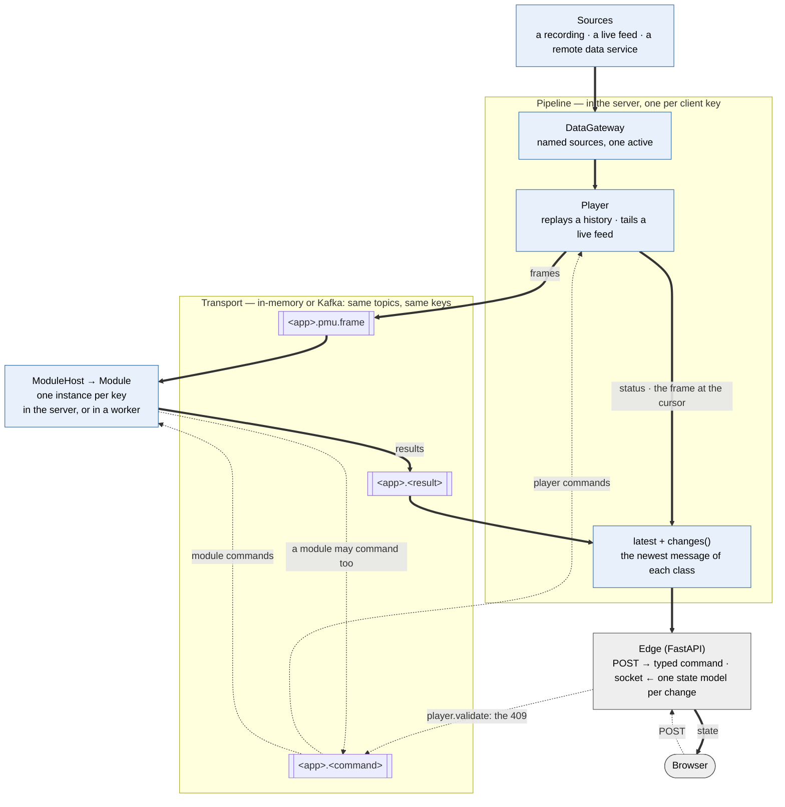
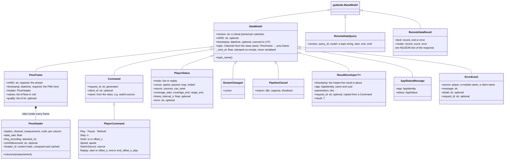
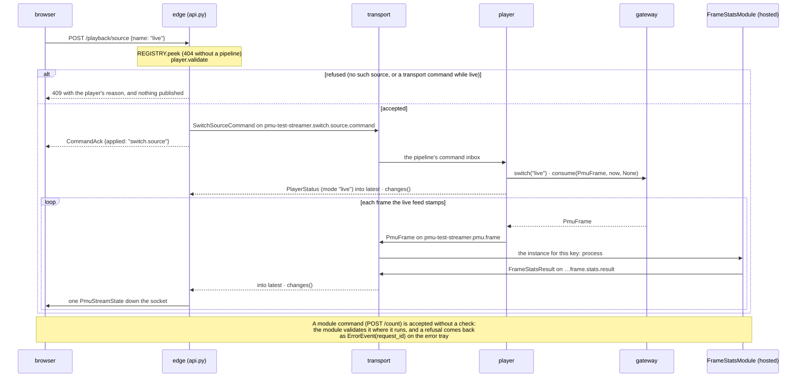
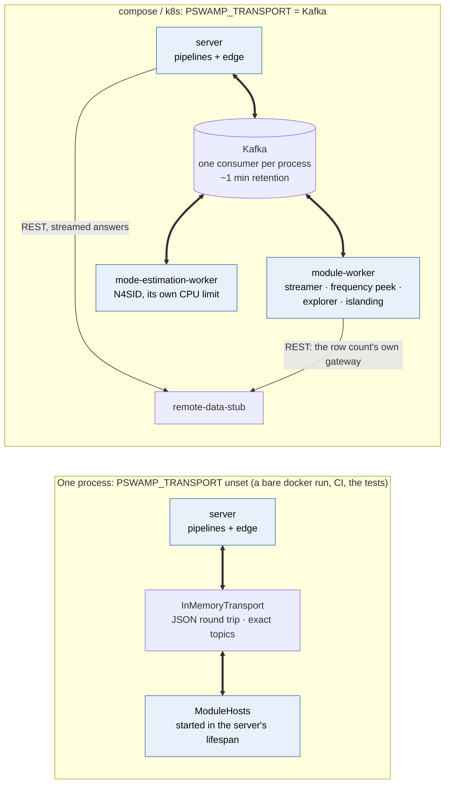

# The server data architecture

How PMU data moves from a source to a browser in the p-SWAMP server, how a
command moves back, and what each piece on the way is for.

The code is the `pswamp_core` package under `core/`. Its only dependency is
pydantic, plus aiokafka behind the `kafka` extra and httpx behind
`remote-data`. The PMU test streamer (`app/server-python/src/pmu_test_streamer/`,
route `/pmu-test-streamer`) is the worked example of every piece and the source
of the snippets below; "Adding a module and its page" is the recipe for your
own.

## The model in five lines

```
DATA DOWN    source → DataClient (the active one) → DataGateway → Player
             → topic <app>.pmu.frame (key = pipeline) → Module → topic <app>.<result> → edge → socket → browser
COMMANDS UP  browser → POST → edge → validate at the player (the 409) → topic <app>.<command> → Player | Module
             a Module may publish a command too (e.g. SwitchSourceCommand)
STATE        the edge builds one state model per change: the newest result per class (Latest) + the local player
WHERE        transport unset → InMemoryTransport, modules hosted in the server; set → Kafka, modules in the worker
```


```mermaid
flowchart TB
    classDef data fill:#e8f1fb,stroke:#3b6ea5,color:#000
    classDef cmd fill:#fff4dd,stroke:#b8860b,color:#000
    classDef edge fill:#eeeeee,stroke:#555,color:#000

    sources["Sources<br/>a recording · a live feed · a remote data service"]:::data
    subgraph pipeline["Pipeline — in the server, one per client key"]
        direction TB
        gw["DataGateway<br/>named sources, one active"]:::data
        player["Player<br/>replays a history · tails a live feed"]:::data
        view["latest + changes()<br/>the newest message of each class"]:::data
    end
    subgraph transport["Transport — in-memory or Kafka: same topics, same keys"]
        direction LR
        frames[["&lt;app&gt;.pmu.frame"]]
        results[["&lt;app&gt;.&lt;result&gt;"]]
        commands[["&lt;app&gt;.&lt;command&gt;"]]
    end
    host["ModuleHost → Module<br/>one instance per key<br/>in the server, or in a worker"]:::data
    edge["Edge (FastAPI)<br/>POST → typed command · socket ← one state model per change"]:::edge
    browser(["Browser"]):::edge

    sources ==> gw ==> player
    player ==>|"frames"| frames ==> host
    host ==>|"results"| results ==> view
    player ==>|"status · the frame at the cursor"| view
    view ==> edge ==>|"state"| browser

    browser -.->|"POST"| edge
    edge -.->|"player.validate: the 409"| commands
    host -.->|"a module may command too"| commands
    commands -.->|"player commands"| player
    commands -.->|"module commands"| host
```

**Every arrow carries a pydantic model** (`PmuFrame`, `PlayerStatus`,
`SeekCommand`, …): JSON with a schema version end to end, and the browser's
TypeScript types are generated from the same classes. A topic is
`<app>.<message class>` and a record's key is its pipeline's key, over either
transport. Thick arrows are data, dotted ones commands, in every diagram here.

## The layers

The core is a stack of layers, numbered from the bottom. **Dependencies point
down**: a provider needs only L1 and the L2 contract, so it can be written
outside the repo; a module needs L1 and the module base, and never sees the
transport, so where it runs is not its concern.

| | Layer | What it is | Where |
|---|---|---|---|
| L1 | Messages | The wire models: `DataModel` and every message derived from it -- `PmuFrame` (carrying its `PmuHeader`), the typed commands, `PlayerStatus`, `ResultEnvelope`, `ErrorEvent`, `PipelineClosed`. pydantic only; what every arrow carries | `messages/` |
| L2 | Gateway | The provider contract (`DataClient`) and the `DataGateway`: named sources, one active, read as one time-addressed stream | `datagateway/` |
| L3 | Player | Paces the active source's stream and owns the transport controls and the source switch | `datagateway/player.py` |
| L4 | Transport | Keyed publish/subscribe, one topic per class per app: `InMemoryTransport` or `KafkaTransport`, and the `Outbox` in front of it. Beside it, command routing: a command's class is its address | `transport/`, `subscription.py`, `command_routing.py` |
| L5 | Modules | Analysis: consume one message class, publish another; hosted one instance per key by a `ModuleHost` | `modules.py`, `host.py`, `keep_up.py` |
| L6 | Pipeline | What an app's pipelines are made of (`PipelineFamily`), one pipeline per key (gateway + player + topics), and the registry that keeps them | `pipeline.py` |
| L7 | Hosting | Which transport a deployment runs (`PSWAMP_TRANSPORT`), which families a worker hosts (`PSWAMP_WORKER_FAMILIES`), and which providers a gateway has (`*_DATA_CLIENTS`) | `transport_from_env`, `worker.py`, `datagateway/config.py` |
| L8 | Web edge | The app package: POSTs that become commands, the socket that pushes state | `app/server-python/src/<app>/` |

## The building blocks

### Messages — `pswamp_core.messages`

*What.* Every message that crosses a topic, a socket or a process boundary is a
`DataModel`: a pydantic model with a schema `version` (pinned per subclass), an
`mRID` identity, a UTC `timestamp`, and a **topic derived from the class name**.

```python
class LineTrip(DataModel):            # topic: "line.trip"
    version: Literal["v1"] = "v1"
    timestamp: datetime
    line: str

LineTrip.model_validate_json(text)    # the whole codec; a "v2" payload fails here
```

*Why.* No pickle and no numpy on the wire means a message can be logged,
validated on receipt, and published into the browser contract without an
adapter. The set of `DataModel` subclasses *is* the topic catalogue.

The measurement shape is **one instant of every channel, carrying its layout**:
`PmuFrame` (timestamp, mRID, `values`, with NaN as null on the wire) holds its
`PmuHeader` (station / channel / measurement / units per column, the data rate,
and a cached content hash `header_id`). The layout rides inside every frame:
about 1.2x on the wire once a broker's batch compression collapses the
repeats, and in return any single frame is enough to work from -- a module
reads the layout off the frame in hand, a late worker is primed by its first
input, and a changed layout is simply the next frame's header.

Every message, and what derives from what:


```mermaid
classDiagram
    class BaseModel["pydantic.BaseModel"]

    class DataModel {
        +version: str, a Literal pinned per subclass
        +mRID: str, optional
        +timestamp: datetime, optional, coerced to UTC
        +topic: ClassVar from the class name, PmuFrame → pmu.frame
        -_sent_at: float, stamped on receipt, never serialised
        +topic_name()
    }
    BaseModel <|-- DataModel

    class PmuFrame {
        +mRID: str, required: the stream
        +timestamp: datetime, required: the PMU time
        +header: PmuHeader
        +values: list of float or null
        +quality: list of int, optional
    }
    class PmuHeader {
        +station, channel, measurement, units: per column
        +data_rate: float
        +freq_encoding: absolute_hz
        +cimReferenceId: str, optional
        +header_id: content hash, computed and cached
        +columns(measurement)
    }
    DataModel <|-- PmuFrame
    PmuFrame *-- PmuHeader : rides inside every frame

    class Command {
        +request_id: str, generated
        +client_id: str, optional
        +name: from the class, e.g. switch.source
    }
    class PlayerCommand {
        Play · Pause · Refresh
        Step: n
        Seek: to or offset_s
        Speed: speed
        SwitchSource: source
        Replay: start or offset_s, end or end_offset_s, play
    }
    Command <|-- PlayerCommand
    class PlayerStatus {
        +mode: live or replay
        +cursor, speed, paused, loop, ended
        +source, sources, can_seek
        +coverage_start, coverage_end, range_end
        +frame_interval_s: float, optional
        +error: str, optional
    }
    class StreamChanged {
        +cursor
    }
    class PipelineClosed {
        +reason: idle, capacity, shutdown
    }
    DataModel <|-- Command
    DataModel <|-- PlayerStatus
    DataModel <|-- StreamChanged
    DataModel <|-- PipelineClosed

    class ResultEnvelope~T~ {
        +timestamp: the instant the result is about
        +app: AppIdentity, name and uuid
        +parameters: dict
        +request_id: str, optional, copied from a Command
        +result: T
    }
    class AppStatusMessage {
        +app: AppIdentity
        +status: AppStatus
    }
    class ErrorEvent {
        +source: player, a module name, a client name
        +message: str
        +detail: str, optional
        +request_id: str, optional
    }
    DataModel <|-- ResultEnvelope
    DataModel <|-- AppStatusMessage
    DataModel <|-- ErrorEvent

    class RemoteDataQuery {
        +version, query_id, model: a topic string, start, end, mrid
    }
    class RemoteDataResult {
        +kind: record, end or error
        +model, record, count, error
        one NDJSON line of the response
    }
    BaseModel <|-- RemoteDataQuery
    BaseModel <|-- RemoteDataResult
```

*Where.* `core/src/pswamp_core/messages/`: `data_model.py`, `pmu.py`,
`results.py` (what modules emit), `commands.py`, `control.py` (player state,
`PipelineClosed`), `errors.py`.

### Providers — `pswamp_core.datagateway.DataClient`

*What.* The contract a data source implements: `coverage`, `consume`,
`produce`, and a declaration of what it can do.

```python
class SampleRecordingClient(DataClient):
    capabilities = Capability.HISTORY_CONSUME          # a file cannot tail live data
    async def coverage(self, model, mRID=None): return Coverage(TimeRange(first, last + interval))
    async def consume(self, model, time_range, mRID=None):
        for frame in self.frames:
            if time_range.contains(frame.timestamp):
                yield frame
    async def produce(self, data): raise TypeError("read-only")
```

*Why.* A client is **one source**: a history (`HISTORY_CONSUME`: replayed,
seekable) or a live feed (`LIVE_CONSUME`: tailed from now), never both -- the
gateway refuses a client that declares both. The core never asks a provider for
what it did not declare. **History lives with the provider**: the repo persists
nothing; a TSO's store, behind its remote data service, is a `DataClient`.

A provider is **chosen and configured from the environment**, never in code --
`PSWAMP_DATA_CLIENTS="sample:pmu_test_streamer.sample_client:SampleRecordingClient,live:…"`,
each client reading its own `{NAME}_{SETTING}` block -- and proves itself with
the **conformance suite** (`DataClientConformance`: inherit it, supply three
fixtures; the cases follow the declared capability).

*Where.* `datagateway/data_client_model.py` (the contract), `config.py`,
`conformance.py`, `clients/in_memory.py` (the reference client). Two providers
written *outside* the core, as a TSO's would be:
`pmu_test_streamer/sample_client.py` (the recording) and `live_client.py` (a
synthetic live feed, the recording's rows re-stamped on the wall clock at
20 Hz). `k8s/p-swamp-local.yaml` points the live feed at a ConfigMap-mounted
file, so it visibly comes from outside the image.

### The gateway — `pswamp_core.datagateway.DataGateway`

*What.* The configured providers as named **sources**, one of them **active**:

```python
gateway.sources                                  # ["sample", "live"], in configured order
gateway.source, gateway.live                     # the active one, and whether it is a live feed
gateway.switch("live")                           # another source is active from now on
gateway.consume(PmuFrame, start=t0, end=None)    # a seek: from t0, onwards
gateway.consume(PmuFrame, start=t0, end=t1)      # a chunk: exactly [t0, t1)
```

*Why.* One source at a time means a stream always has one provider behind it,
so which one is never a question of coverage, priority or timing: the first
source configured is active, and only an explicit switch changes it. "Jump to
a time" and "query a chunk" are the same call. An **enricher** hook runs on
every payload the stream yields (see "A CIM reference on the frame"). This
layer is Louis Pauchet's `test_pswamp` draft, lifted, without its routing of
one stream across several clients.

*Where.* `datagateway/data_gateway.py`, `stream.py`, `time_range.py`, `enrich.py`.

### The player — `pswamp_core.datagateway.Player`

*What.* Paces the active source's stream and owns the controls.

```python
player = Player(gateway, sink, model=PmuFrame, speed=1.0, loop=True)
await player.start()                 # a history replayed from its start, paused; a live source tailed
player.resume(); player.pause(); player.set_speed(2.0)
await player.step(-1)                # one frame back
await player.seek(t)                 # a NEW stream from t, announced as StreamChanged
await player.switch_source("live")   # a NEW stream on another source; its kind sets the mode
await player.replay(t0, t1)          # a BOUNDED replay of [t0, t1): ends paused at t1, never loops
player.status()                      # PlayerStatus: mode, source, sources, cursor, speed, can_seek, error, …
```

*Why.* The gateway yields as fast as the provider reads; a person watching a
disturbance needs real time, and needs to scrub. The decisions made once:

- **Mode is the active source's kind.** A history is *replayed*: paced,
  seekable, looping at its end. A live source is *tailed*: delivered as it
  arrives, with no transport controls. The status carries `sources`, `mode` and
  `can_seek`, so a page renders no dead buttons.
- **Seek is a new stream**; a stream only ever moves forward.
- **Pacing drops time rather than bursting** when the loop falls behind.
- **A provider failure ends the stream loudly**: paused, `PlayerStatus.error`
  set, an `ErrorEvent` published. The pipeline still starts, so the page
  connects and shows why; a `RefreshCommand` asks again.
- **The next-frame read is a task awaited outside the lock**, so a live feed
  gone quiet never blocks a switch away from it.

It publishes into a *sink* -- its pipeline -- and never waits on it.

*Where.* `datagateway/player.py`.

### The transport — `pswamp_core.transport`

*What.* The one publish/subscribe in the core: **one topic per message class,
namespaced by the app, and the pipeline key on every record.**

```python
await transport.publish(frame, app="pmu-test-streamer", key="42")   # topic pmu-test-streamer.pmu.frame
with transport.subscribe(FrameStatsResult, app="pmu-test-streamer", key="42") as results:
    async for key, result in results: ...                          # key "42" only
with transport.subscribe(PmuFrame, app="pmu-test-streamer") as frames:
    async for key, frame in frames: ...                            # every key: a host's view
```

Two implementations, and the deployment picks one with `PSWAMP_TRANSPORT`:
`InMemoryTransport` (unset: one process, no port) and `KafkaTransport`
(`kafka:pswamp_core.transport.kafka:KafkaTransport` plus
`KAFKA_BOOTSTRAP_SERVERS`). An `Outbox` sits in front of it for each pipeline
key: the player and modules publish synchronously and never wait, a broker
acknowledges, and when the outbox is full it drops the oldest *data* message
-- never a command or an error -- and says so.

*Why.*

- **One mechanism, not two.** A module is always reached over the transport,
  so "in-process" and "in a worker" are not two code paths but two transports.
- **The in-memory transport behaves as a broker does**: every message is
  serialised to JSON and parsed back, and a topic carries exactly one class (a
  subscriber to `ResultEnvelope` hears no subclass). So a message that would not
  survive the wire fails in a hermetic test, not in the deployment.
- **The app is part of the topic**, so two apps whose modules read `PmuFrame`
  under the same browser client id never read each other's frames.
- **A transport is not a provider.** It carries what was published, in order,
  and never reads a timestamp -- a replay whose timestamps jump back at every
  loop crosses it unharmed. A broker *as a source* would be a `DataClient`.
- **One Kafka consumer per process**, assigned every topic the process listens
  to, reading a new topic from its end. (One consumer per topic, some fifty in
  the server, starved each other of the broker.)

*Where.* `core/src/pswamp_core/transport/__init__.py` (`Transport`,
`InMemoryTransport`, `Outbox`, `transport_from_env`), `transport/kafka.py`,
`subscription.py` (a consumer's queue and its overflow policy).

### Modules — `pswamp_core.modules.Module`

*What.* Consume one message class, publish another; answer commands, if it
declares any.

```python
class FrameStatsResult(ResultEnvelope[FrameStats]):     # topic: frame.stats.result
    version: Literal["v1"] = "v1"

class FrameStatsModule(Module):
    name = "frame-stats"
    input_model = PmuFrame
    output_model = FrameStatsResult
    async def process(self, frame: PmuFrame) -> FrameStats | None: ...
```

*Why.* A contributor's module is the analysis and two class attributes: `run`
reads its input queue, calls `process`, wraps the result in the envelope
(`timestamp`, `app`, `parameters`, `request_id`) and publishes it into its
`out`. A module never sees the transport. **A `ModuleHost` runs it**: one
instance per pipeline key, built on the first message for that key, fed off the
app's topics, and dropped when the pipeline says `PipelineClosed` (or, as a
backstop, after five minutes of silence). A module that answers commands lists
their concrete classes in `commands` and implements `handle` (and `validate`,
if it can refuse one). A module that reads the gateway itself -- a batch
question over a range -- gets one in `setup`, built by the app's family from
the same configuration the pipeline's player reads, wherever it is hosted.

*Where.* `core/src/pswamp_core/modules.py`, `host.py`, `keep_up.py`;
`pmu_test_streamer/stats_module.py` (a module that reduces a frame, re-deriving
its columns when `header_id` changes); `time_series_explorer/row_count_module.py`
(a module that answers a command by reading the gateway).

### Pipeline, family and registry — `pswamp_core.pipeline`

*What.* What an app's pipelines are made of, declared once; one pipeline per
key; and the registry that builds, caps and evicts them.

```python
FAMILY = PipelineFamily("pmu-test-streamer", gateway_factory, (FrameStatsModule,))   # <app>/family.py

REGISTRY = PipelineRegistry(lambda key: Pipeline(key, FAMILY, transport(), loop=True))
pipeline = await REGISTRY.acquire(client_id)   # builds on first connect; one per key
pipeline.latest.get(FrameStatsResult)          # the newest result, as the edge reads it
with pipeline.changes() as changes: ...        # a wake-up on every change, coalesced
REGISTRY.peek(client_id)                       # a command's view: never builds
```

*Why.* The **family** is the one description both sides share: the server
builds a pipeline per key from it, and a host -- in the server or in a worker --
hosts its modules from it. A **pipeline** is a gateway, a player and the
family's topics under one key; it publishes the player's frames to the
modules, listens for their results, and keeps the newest message of each
class (`latest`) with a wake-up (`changes()`) for the socket. That local view
is not a bus: an endpoint builds its message from current state, so however
much arrived meanwhile it sends one. The key is the unit of isolation: a
**replay is keyed per client**, because a visitor exploring recorded data wants
their own clock. The registry keeps one pipeline per key, lets it outlive its
sockets for an idle grace period so a reload rejoins, reclaims the
least-recently-used idle one at the cap, and refuses when none can be.

*Where.* `core/src/pswamp_core/pipeline.py`; each app's `family.py`.

### Commands — `pswamp_core.command_routing`

*What.* An operator's action as a typed message whose **class is its address**,
travelling on its own topic.

```python
pipeline.dispatch(SeekCommand(client_id=id, offset_s=12))
#   a player command?  player.validate(cmd)     raises CommandRefused → the POST's 409
#   a module command?  accepted as it is        the module checks it where it runs
#   then               outbox → topic pmu-test-streamer.seek.command, key = client id
# ... the receiver's CommandInbox: validate again, then await receiver.handle(cmd)
```

*Why.* The class is the address and the arguments are validated fields: a
family refuses two receivers of one class, and a declared class must be
concrete, since a topic carries one class. **The player lives with the edge**,
so its commands are checked before they are published and a refusal is an
honest 409. A module may be in another process, so its commands are accepted
and checked where it runs; a refusal there -- or anything that fails while
applying a command -- is an `ErrorEvent` carrying the command's `request_id`, on
the error tray. Commands travel on topics even to the player, so a **module
can command the player** exactly as the edge does (a `SwitchSourceCommand`, say).

*Where.* `core/src/pswamp_core/command_routing.py` (the inbox,
`CommandRefused`); `messages/commands.py` (the base and the player's
commands; `PLAYER_COMMANDS` in `player.py`). A module's own commands live
beside the module, as `CountRangeCommand` does in `row_count_module.py`.

### The web edge — the app package

*What.* What is left in an app's `api.py` once the core does the rest: which
state to build for the socket, and which POSTs build which typed command.

```python
@router.post("/playback/source", responses=COMMAND_RESPONSES)
async def source(client_id: ClientId, body: SourceBody) -> CommandAck:
    return dispatch_command(REGISTRY, SwitchSourceCommand(client_id=client_id, source=body.name), logger)

@router.websocket("/ws")
async def ws_endpoint(ws: WebSocket) -> None:
    async with connected_pipeline(ws, REGISTRY) as pipeline:
        if pipeline is not None:
            await push_changes(ws, pipeline, lambda: state_message(pipeline))
```

*Why.* Everything else is shared, in `shared.py`: `transport()` (one per
process), `serve_family` (an app's lifespan: its registry, its errors forwarded
to the tray, and -- with the in-memory transport -- its modules hosted in the
server), `connected_pipeline` (1008, 1013, 1011), `push_changes` (one message on
connect and one per change, coalesced), and `dispatch_command` (404 without a
pipeline, 409 when refused). The browser contract is unchanged: commands up as
POSTs, state down one socket, an acknowledgement that never carries state,
everything generated into `doc/api/openapi.json`.

*Where.* `app/server-python/src/<app>/api.py`, `shared.py`; the pages in
`app/client-web/src/pages/`.

## A command's round trip

Switching the streamer's source changes the most; every other command takes
the same path and differs only in what its receiver does. A module command
(the explorer's count) differs in one place, shown last.


```mermaid
sequenceDiagram
    participant B as browser
    participant E as edge (api.py)
    participant T as transport
    participant P as player
    participant G as gateway
    participant M as FrameStatsModule (hosted)

    B->>E: POST /playback/source {name: "live"}
    Note over E: REGISTRY.peek (404 without a pipeline)<br/>player.validate
    alt refused (no such source, or a transport command while live)
        E-->>B: 409 with the player's reason, and nothing published
    else accepted
        E->>T: SwitchSourceCommand on pmu-test-streamer.switch.source.command
        E-->>B: CommandAck {applied: "switch.source"}
        T->>P: the pipeline's command inbox
        P->>G: switch("live") · consume(PmuFrame, now, None)
        P-->>E: PlayerStatus (mode "live") into latest · changes()
        loop each frame the live feed stamps
            G-->>P: PmuFrame
            P->>T: PmuFrame on pmu-test-streamer.pmu.frame
            T->>M: the instance for this key: process
            M->>T: FrameStatsResult on …frame.stats.result
            T-->>E: into latest · changes()
            E->>B: one PmuStreamState down the socket
        end
    end
    Note over B,M: A module command (POST /count) is accepted without a check:<br/>the module validates it where it runs, and a refusal comes back<br/>as ErrorEvent(request_id) on the error tray
```

1. **The button.** The page renders one button per name in `player.sources`,
   pressed for `player.source`, and fires only on a change. `switchSource(name)`
   is a `postCommand` typed against the generated `schema.ts`.
2. **The edge** builds the `SwitchSourceCommand` (which generates its
   `request_id`) and hands it to `dispatch_command`; the ack means *published*,
   not applied.
3. **The player applies it** off its inbox: the gateway switches, the old
   stream closes and a new one opens -- a history at its start (paused), a live
   feed from now (playing) -- and the status says so.
4. **And back down**, the same for every source: frames to the hosted module,
   results back into `latest`, one state message per change. The page turns red
   because the *server* says the mode is live, not because a button was pressed.

## Where things run


```mermaid
flowchart LR
    classDef data fill:#e8f1fb,stroke:#3b6ea5,color:#000
    subgraph one["One process: PSWAMP_TRANSPORT unset (a bare docker run, CI, the tests)"]
        direction TB
        s1["server<br/>pipelines + edge"]:::data
        m1["InMemoryTransport<br/>JSON round trip · exact topics"]
        h1["ModuleHosts<br/>started in the server's lifespan"]:::data
        s1 <==> m1 <==> h1
    end
    subgraph many["compose / k8s: PSWAMP_TRANSPORT = Kafka"]
        direction TB
        s2["server<br/>pipelines + edge"]:::data
        k[("Kafka<br/>one consumer per process<br/>~1 min retention")]
        w1["module-worker<br/>streamer · frequency peek ·<br/>explorer · islanding"]:::data
        w2["mode-estimation-worker<br/>N4SID, its own CPU limit"]:::data
        stub["remote-data-stub"]
        s2 <==> k
        k <==> w1
        k <==> w2
        s2 -->|"REST, streamed answers"| stub
        w1 -->|"REST: the row count's own gateway"| stub
    end
```

*What.* The boxes are the same in both columns; only the transport differs.
With nothing configured the server builds an `InMemoryTransport` and starts a
`ModuleHost` per module class in its own lifespan. With
`PSWAMP_TRANSPORT` naming Kafka, the server hosts nothing and the workers --
the same image, running `python -m pswamp_core.worker` -- host the families
named in `PSWAMP_WORKER_FAMILIES` (`pmu_test_streamer.family:FAMILY,…`). A
worker is configured like the server in one more way: a hosted module that
reads the gateway gets one built from the same `*_DATA_CLIENTS` variables, so
those go to the worker too.

*Why.* A heavy module gets a process -- and a CPU limit -- of its own without
touching its code or its page, and a deployment that wants no broker runs one
container. The player, and so every player command, stays in the server either
way. The in-memory mode is not a test double: it is the same code path with a
different transport, which is what lets CI's single container exercise every
page.

*Where.* `transport_from_env`, `host.py` (`hosts_for`, `serve_hosts`),
`worker.py`; `shared.serve_family`; `module-worker` and
`mode-estimation-worker` in `docker-compose.yml` and `k8s/p-swamp-local.yaml`.

## What is per client, what is shared

| | per client today | for a shared live feed (designed, not yet built) |
|---|---|---|
| pipeline key | the browser's client id | the stream name |
| gateway | its own, with its own client instances (and live ticker) | the deployment's live and history clients, once |
| player | one per client: own cursor, speed and source | one per stream, always live; "pause" is view state |
| modules | one instance per key, in a host | one per stream, results shared |
| topics | shared by every key of the app; the record key keeps them apart | the same |
| socket | one per page per client | one per page per client |

The gateway lives inside the pipeline because it holds the *provider's* state,
and that is per consumer as soon as anything tails: a live client holds a
queue per open `consume()`, a database client a cursor. The `DataClient`
contract has no consumer identity, on purpose, so a provider stays simple to
write. Only the parsed recordings are shared across pipelines (`lru_cache`d
and never written to). The cost is what the registry caps: a streamer pipeline
is a handful of tasks and no threads.

That is the honest limit: the streamer's live feed is per client because the
gateway is -- right for a synthetic source, wrong for a real one, where every
viewer must see the same instant and the analysis must run once. The answer is
the right-hand column: one pipeline keyed by the *stream*. It is still a
design.

## Adding a module and its page

**A provider** (a TSO's data source): implement `DataClient` in your own
package, importing `pswamp_core.datagateway` and `pswamp_core.messages` only;
declare `env_settings`; inherit `DataClientConformance` in a test; name the
class in the app's `*_DATA_CLIENTS`. Nothing in this repo changes;
`sample_client.py` is the model.

**A module and the page that shows it** is one app package. `frequency_peek/`
is the recipe at its smallest (one module, a live-only page, no commands);
the streamer is the same shape with more in it.

1. `./scripts/generate-new-subapp.sh my-thing "My Thing"` for the folders and
   registry entries; replace the counter it writes.
2. **The module**, in its own file: a pydantic result body, the envelope
   (`class MyThingResult(ResultEnvelope[MyThingBody])`), and a `Module` with
   `name`, `input_model`, `output_model` and `process`. Read the layout off
   `frame.header`. A command it answers is a concrete class beside it, listed
   in `commands`, with `handle` returning the result body. Import only
   `pswamp_core`.
3. **The family**, `my_thing/family.py`:
   `FAMILY = PipelineFamily("my-thing", gateway, (MyThingModule,))`, where
   `gateway()` is `gateway_from_env(DEFAULT_DATA_CLIENTS, variable="MY_THING_DATA_CLIENTS")`.
   This is the only registry a module has.
4. **The pipeline and lifespan**, in `api.py`: `Pipeline(key, FAMILY,
   transport(), ...)` in the registry's factory (`autoplay=True, loop=True` for
   a page without a transport row), and `lifespan` entering
   `serve_family(FAMILY, REGISTRY)` -- which also forwards errors to the tray
   and hosts the module in-process when there is no broker.
5. **The socket**: a state model exported as `WS_MESSAGE`, built from
   `pipeline.latest.get(MyThingResult)` and the player; the endpoint is
   `connected_pipeline` + `push_changes` from `shared.py`.
6. **Commands**, if any: one POST per operation returning
   `dispatch_command(REGISTRY, command, logger)`, with
   `responses=COMMAND_RESPONSES`.
7. **The page**: `useServerSocket<Wire['MyThingState']>(MY_THING_WS_PATH)`.
8. **Deployment**: add `my_thing.family:FAMILY` to `PSWAMP_WORKER_FAMILIES` of
   a worker in compose and k8s (and its `*_DATA_CLIENTS`, if the module reads
   the gateway). Nothing else changes.
9. `generate-api-contract.sh`, `error_check.sh`, `run-python-server-tests.sh`,
   and a Playwright spec under `e2e/`. Tests: call `process` directly; run the
   pipeline inside the app's `lifespan`, which hosts the module in-process.

**A new data type** needs nothing from `core/`: declare it once as a
`DataModel` subclass where every consumer can import it -- beside the module
if only that app uses it, in `core/src/pswamp_core/messages/` otherwise -- pin
`version: Literal["v1"]`, and give it a `timestamp` if a player will pace it.
A topic carries one class, so its producer and consumers must import the same
class. An *input* type needs a provider serving it and a
`Pipeline(..., model=YourType)`.

## A remote data service as a provider

*What.* `RemoteDataClient` (`datagateway/clients/remote_data.py`, the
`pswamp-core[remote-data]` extra) is a `DataClient` over a deployment's own
data service: a small REST api in front of whatever store holds its history.
A range query goes up as `POST /v1/queries`; the records come back as that
call's streamed response, one NDJSON line each, closed by an `end` (or
`error`) line; coverage is `GET /v1/coverage`. **The contract is
`doc/remote-data-integration-contract.md`**, in HTTP terms alone;
`scripts/check-remote-data-service.sh` checks a running service against it.

*Why.* Decoupling: p-SWAMP asks for a range and gets it back; which store
answers is the deployment's choice. The answer comes back on the connection
that asked, which keeps the contract small -- no correlation id, no second
channel, no cancel route (closing the connection is the cancel) -- and gives
backpressure for free. A command never reaches a data client: it stops at the
player or a module, which asks the gateway for a range like anyone else.
`/time-series-explorer` drives it two ways: **play-range** (the player's
bounded replay) and **count** (`RowCountModule`, answering a
`CountRangeCommand` from its own gateway -- in the module worker under
compose). The dummy service `core/examples/remote_data_stub/` stands in for a
deployment's service in compose and k8s.

*Where.* Everything of the contract is under `core/`:
`messages/remote_data.py`, `datagateway/clients/remote_data.py`, and outside
the package `examples/remote_data_stub/` and
`examples/check_remote_data_service.py`. Tests:
`core/tests/test_remote_data_service.py` (the conformance suite over the stub,
in-process), `test_remote_data_client.py` (the lazy pull, cancel by closing).

## Errors and keeping up

*What.* `ErrorEvent` is what a pipeline publishes when something
*operational* fails: the player's provider raised, a module's `process`
raised, a command was refused where it ran. Every one goes on the app's error
topic (`<app>.error.event`) under the pipeline key; one `forward_errors` task
per app (started by `serve_family`) hands them to a per-client hub, and
`/api/errors/ws` pushes them to the layout's `<ErrorTray>` on every page. Not
an alarm: grid alarms are a correctly running application's result.

A module that **falls behind** says so the same way. Its `KeepUpMonitor`
watches its input queue: input the `DROP_OLDEST` queue discarded, and how long
each input had been in flight when read (the transport stamps the send time,
`messages.sent_at()`; never on the wire). Past the module's `keep_up` policy --
by default any drop, or input older than 2 s -- it reports once on falling
behind, at most every 5 s while behind, once on catching up. The pipeline's
outbox does the same for publishing ("the server-side publisher … cannot
publish").

*Why.* Dropping stale frames is right for a live stream, and silent; under
load that silence hides exactly what an operator needs to know. The load
tests exercise it. `/islanding-stream` runs p-SWAMP's islanding detector over
the 700-channel N44 recording with the replay speed as the knob: the first
limit is the server's one event loop, at ~2000 published 41 KB frames a second.
`/mode-estimation` runs N4SID identification (~0.6 s of CPU per data-second
per client): **a CPU-bound module must leave the event loop** -- in a thread or
process pool, with one BLAS thread per identification, since BLAS's default
threading inside a pool multiplies the CPU and collapses throughput. Every
topic has about a minute's retention, enforced every 10 s by the compose and
k8s brokers: the broker's defaults let a fast replay fill the disk.

*Where.* `messages/errors.py`; `keep_up.py`; `transport/__init__.py`
(`Outbox`); `app/server-python/src/errors/`; `hooks/useErrorFeed.ts`,
`components/ErrorTray.tsx`; `islanding_stream/`, `mode_estimation/`.

## A CIM reference on the frame

*What.* The gateway stamps every PMU frame with an optional
`PmuHeader.cimReferenceId`: an id for the grid (CIM) data that applies to it.
An **enricher** passed to `DataGateway` runs on every payload the stream
yields; `CimReferenceEnricher` decides the reference once per layout. **It is
a stub**: one configured placeholder (`ISLANDING_STREAM_CIM_REFERENCE`, or
`none`); a lookup against a CIM model overrides one method.

*Why.* The gateway is where every reader's frames pass, so every reader sees
the same reference, decided once, early. It travels with the frame, so a
hosted module gets it with no configuration of its own, and it is a reference
rather than the grid data itself, which would cost several KB a frame.

*Where.* `messages/pmu.py`, `datagateway/enrich.py`,
`islanding_stream/family.py` (the wiring) and the islanding module's
`cim_reference_id`.

## What is deliberately not here yet

- a live pipeline shared by every viewer (keyed by the stream, not the client);
- the bridge from the desktop package's thread-based `SnapshotApp`s to a
  pipeline, and the grid monitor re-pointed at the core (it still runs its own
  `Hub`/`Bus` in `pswamp_web/`);
- more than one replica of a worker: topics have one partition and workers no
  consumer group, so a second replica would answer every frame twice;
- a hosted module's gateway following the player's source switch (the
  explorer's has one source, so it does not matter yet);
- a short tombstone after `PipelineClosed`, so a frame still in flight does not
  rebuild the instance until the idle sweep;
- `request_id` in the browser-facing acknowledgement;
- cheaper frames (no re-validation of what a provider built; the header
  serialised once per layout), producer batching and keyed partitions;
- a CSV provider, a broker *as history*, and a `PmuFrameAssembler` for
  deployments that ingest per-PMU messages.
