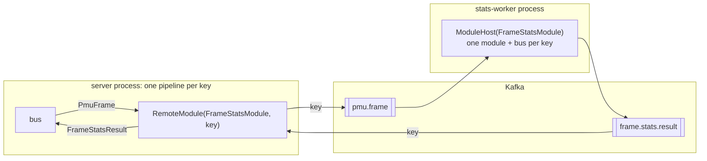

# The server data architecture

How PMU data gets from a data source, through analysis modules, to the web
client, and what each piece on that path is for.

The architecture lives in `core/` as the Python package `pswamp_core`. The web
backend (`app/server-python/`) builds on it. One example runs through this
document and the code: the **PMU test streamer**, a recorded and a live PMU
feed going through one module to one page. Each section below names the code
that implements it.

## What it has to do

| Requirement | Answered by |
|---|---|
| PMU data from several possible sources, processed by swappable modules, delivered to the browser | providers → gateway → player → bus → modules → web edge |
| Adding a module is easy, and its contract (what it receives, what it sends) is explicit | `Module`: one input class, one output class, `process` |
| A heavy module can run as its own process/pod | `RemoteModule` + a worker process, over a transport |
| One place defines the shared pieces and data models | `core/` (`pswamp_core`) |
| Topics go through a transport layer, so Kafka can be swapped out (e.g. for NATS) | `Transport`, with Kafka as the default implementation |
| Pipelines of modules can be defined | `Pipeline`: one gateway, player, bus and module list per key |
| Commands are defined in the core, can be sent upstream, and are picked up by whichever piece declares them | typed `Command` classes, routed by class |
| Runs in compose and in minikube | a worker is the same image with a different command |
| A data source outside the project can be plugged in through a REST contract | `RemoteDataClient` + `doc/remote-data-integration-contract.md` |
| Frames get a reference to the CIM model early, so later modules can look up grid data | gateway enrichers stamp `PmuHeader.cimReferenceId` |
| Live pipelines are shared by every viewer; recorded ones are per client | the pipeline *key*: the stream name for live, the client id for recorded |

## Terms

- **Message**: a pydantic `DataModel`. Everything that crosses a topic, a
  socket or a process is one. The class *is* the topic.
- **PmuFrame**: one instant of every PMU channel. It carries its own layout
  (`PmuHeader`), so any single frame is enough to work from.
- **Command**: a message that asks for something (play, seek, reset). It is
  routed by its class to the one piece that declared it.
- **Provider** (`DataClient`): a data source. It declares what it can do:
  serve history, tail live data.
- **Gateway** (`DataGateway`): a pipeline's providers, at most one for history
  and one for live, behind two reads: `consume` (history) and `tail` (live).
  Enrichers run here.
- **Player**: pulls from the gateway and paces frames onto the bus. It takes
  the replay commands.
- **Bus**: in-process publish/subscribe, typed on message classes. There is one
  bus per pipeline.
- **Transport**: publish/subscribe *between* processes (Kafka, or in-memory for
  tests). A module only ever sees a bus; the transport matters only once a
  module moves out of the process.
- **Module**: analysis. It consumes one message class off the bus and publishes
  another.
- **Worker**: a process that hosts a module for every pipeline that uses it.
- **Pipeline**: one gateway, player, bus and module list, built per *key*.
- **Web edge**: an app package in the web backend. It turns `POST`s into
  commands and pushes state down a WebSocket.

## The picture


```mermaid
flowchart TB
    subgraph sources["providers"]
        direction LR
        rec["recording<br/>(history)"]
        live["live feed"]
        remote["remote data service<br/>(REST, outside the project)"]
    end
    gw["gateway<br/>+ enrichers (CIM reference)"]
    player["player"]
    bus["bus (one per pipeline)"]
    mod["module"]
    worker["worker process"]
    edge["web edge<br/>POST → command · state → WebSocket"]
    browser(["browser"])

    rec --> gw
    live --> gw
    remote --> gw
    gw --> player -- frames --> bus
    bus -- input --> mod -- result --> bus
    mod <-. "optional: over a transport (Kafka)" .-> worker
    bus --> edge --> browser
    browser -. "POST" .-> edge -. "command, routed by class" .-> bus
```

Data flows down, and commands flow up. Every arrow carries a message. Nothing
above the bus knows what is below it, which is why a provider can be swapped
and a module can be moved out of the process without the page noticing.

## Messages — `pswamp_core.messages`

*What.* Every message is a `DataModel`: a pydantic model with a pinned schema
`version`, an optional `mRID` identity, a UTC `timestamp`, and a **topic
derived from the class name**.

```python
class LineTrip(DataModel):            # topic: "line.trip"
    version: Literal["v1"] = "v1"
    timestamp: datetime
    line: str

LineTrip.model_validate_json(text)    # the whole codec; a "v2" payload fails here
```

| Kind | Classes | File |
|---|---|---|
| measurement | `PmuFrame`, carrying its `PmuHeader` | `pmu.py` |
| command (up) | `Command`, `PlayerCommand` and its subclasses (`PlayCommand`, `SeekCommand`, `GoLiveCommand`, …) | `commands.py` |
| result (down) | `ResultEnvelope[T]`: what every module emits | `results.py` |
| control (down) | `PlayerStatus`, `StreamChanged` | `control.py` |
| error (down) | `ErrorEvent`: something operational failed | `errors.py` |

*Why.* No pickle and no numpy on the wire: a message can be logged,
validated on receipt, and published into the browser contract as is. The set
of `DataModel` subclasses *is* the topic catalogue.

**A frame carries its layout.** `PmuFrame.header` is repeated in every frame
(~1.2x on the wire after a broker's compression). In return, any single frame
is enough to work from: a module in another process is primed by its first
frame, and a changed layout is just the next frame.

**A command's class is its address.** There are no verb strings: `SeekCommand`
*is* the seek, and its fields are its validated arguments. A module's own
commands and result classes live beside the module; the player's live here,
because the player is core.

## Topics: the bus — `pswamp_core.bus`

A topic is a message class. Two layers carry topics: the bus inside a process,
and the transport between processes (next section). **A module only ever sees
the bus.**

**The bus** (`InProcessBus`) is publish/subscribe inside one process. There is
one bus per pipeline, and a subscription to a base class receives every
subclass.

```python
bus = InProcessBus()
with bus.subscribe(PmuFrame, overflow=Overflow.DROP_OLDEST, maxsize=64) as frames:
    async for frame in frames: ...
bus.publish(result)                     # from the event loop
bus.publish_threadsafe(result)          # from a thread: the one crossing point
```

Overflow is chosen per subscription: `DROP_OLDEST` for a live stream, `GROW`
for commands. So a slow browser tab drops its
own frames and never stalls the analysis. `Latest` keeps the newest message
of each class, which is what a freshly connected socket renders from.

## Topics between processes: the transport — `pswamp_core.transport`

The transport (`Transport`) is publish/subscribe *between* processes. It
comes into play only when a module runs as its own service. There is one
topic per message class, and the pipeline key rides as the record key, never
as a message field:

```python
await transport.publish(frame, key="42")                  # topic pmu.frame, key "42"
with transport.subscribe(FrameStatsResult, key="42") as results: ...
with transport.subscribe(PmuFrame) as frames: ...         # every key: a worker's view
```

| Implementation | Where | Used by |
|---|---|---|
| `InMemoryTransport` | `transport/__init__.py` | tests: one instance shared by both sides *is* the broker |
| `KafkaTransport` | `transport/kafka.py`, the `pswamp-core[kafka]` extra | compose and k8s |

*Why a transport, not the broker as the bus.* The broker carries only what
crosses a process boundary. Everything else stays a method call on the event
loop. Swapping Kafka for NATS means one new `Transport` subclass that implements
`publish` and `_feed` (one broker consumer per class). Nothing above it
changes. `InMemoryTransport` is the second implementation that keeps the
contract honest.

A transport is chosen from the environment, like everything plugged in by name
(`pswamp_core.settings`):

```
PMU_TEST_STREAMER_MODULE_TRANSPORT=kafka:pswamp_core.transport.kafka:KafkaTransport
KAFKA_BOOTSTRAP_SERVERS=kafka:9092        # the transport's own {NAME}_{SETTING} block
```

Kafka topics are created with about a minute's retention (`LIVE_TOPIC_CONFIGS`).
Every topic is a live hop that nobody reads back, and the broker's defaults let
a fast replay fill a disk.

## Modules — `pswamp_core.modules.Module`

*What.* A module consumes one message class off the bus and publishes another.
That is the whole contract: its **input** is `input_model`, and its **output**
is `output_model`, a `ResultEnvelope[Body]` subclass whose name is its topic.

```python
class FrameStats(BaseModel):                            # the result body
    mean_frequency_hz: float | None
    ...

class FrameStatsResult(ResultEnvelope[FrameStats]):     # topic: frame.stats.result
    version: Literal["v1"] = "v1"

class FrameStatsModule(Module):
    name = "frame-stats"
    input_model = PmuFrame
    output_model = FrameStatsResult

    async def process(self, frame: PmuFrame) -> FrameStats | None:
        ...                                             # None publishes nothing
```

`Module.run` subscribes, calls `process`, wraps the body in the envelope
(timestamp, the module's identity, its `parameters`) and publishes it. A
`process` that raises publishes an `ErrorEvent` and the module carries on.
Whoever shows the result subscribes to `FrameStatsResult`, never to the
module.

*Why.* A contributor's module is the analysis plus two class attributes. It
imports only `pswamp_core`, and it never learns whether it runs in-process or
as its own service.

**Adding a module:**

1. Define the result body (pydantic) and its envelope beside the module. If
   another package must import it, put it in `core/.../messages/` instead.
2. Subclass `Module` with `name`, `input_model`, `output_model`, `process`.
   Read the layout off `frame.header`, and re-derive it when `header_id`
   changes. Don't cache anything the frame does not bring, so the module can
   later move to a worker unchanged.
3. Test it by calling `process` directly (see
   `app/server-python/tests/test_pmu_test_streamer.py`).
4. Put it in a pipeline's module list (see "Pipelines" below).

`process` runs on the event loop. A CPU-heavy module must hand its work to a
thread or process pool, or it stalls every pipeline in its process.

*Where.* `core/src/pswamp_core/modules.py`. The example is
`app/server-python/src/pmu_test_streamer/stats_module.py`.

## Running a module as its own service — `pswamp_core.remote`

*What.* The module's slot in the pipeline is taken by a stand-in,
`RemoteModule`, which carries the module's input class out to a broker topic
and its result class back. A worker process runs the real module through
`ModuleHost`, one instance per pipeline key. Nothing in the module changes,
and nothing above the bus notices.


```mermaid
flowchart LR
    subgraph server["server process: one pipeline per key"]
        bus["bus"] -- PmuFrame --> rm["RemoteModule(FrameStatsModule, key)"]
        rm -- FrameStatsResult --> bus
    end
    subgraph kafka["Kafka"]
        t1[["pmu.frame"]]
        t2[["frame.stats.result"]]
    end
    subgraph worker["stats-worker process"]
        host["ModuleHost(FrameStatsModule)<br/>one module + bus per key"]
    end
    rm -- "key" --> t1 --> host --> t2 -- "key" --> rm
```

One variable, which both sides read, is the whole switch:

```
PMU_TEST_STREAMER_MODULE_TRANSPORT=kafka:pswamp_core.transport.kafka:KafkaTransport
KAFKA_BOOTSTRAP_SERVERS=kafka:9092
```

When it is unset, the module runs in-process.

**Deploying.** A worker is the server's image with a different command:
`python -m pmu_test_streamer.worker`, whose whole body is
`main(FrameStatsModule, "PMU_TEST_STREAMER_MODULE_TRANSPORT")`. Compose runs
it as `stats-worker` beside `kafka`, and `k8s/p-swamp-local.yaml` runs it as
the `p-swamp-stats-worker` Deployment beside `p-swamp-kafka`. Give it no port
and one replica: a host owns every key it sees.

*Why.* A heavy module gets its own process (its own CPU limit, its own pod)
and cannot stall the server's event loop. The input is all a worker needs,
because a frame carries its layout: a worker that starts late, or a key that
was evicted and rebuilt, is primed by the first frame it sees. An `ErrorEvent`
raised in the worker comes back under the key to the pipeline's bus.

*Where.* `core/src/pswamp_core/remote.py`, `core/tests/test_remote.py`, and
`app/server-python/src/pmu_test_streamer/worker.py`.

## Providers — `pswamp_core.datagateway.DataClient`

*What.* A **provider** (`DataClient`) is a data source. It declares what it
can do (serve history, tail live data) and implements `coverage` (what time
window it holds now) and `consume` (stream a window):

```python
class SampleRecordingClient(DataClient):
    capabilities = Capability.HISTORY_CONSUME        # a file cannot tail live data
    async def coverage(self, model, mRID=None) -> Coverage | None: ...
    async def consume(self, model, time_range, mRID=None): ...   # an async iterator
```

A provider is configured from the environment: it declares `env_settings`, and
`from_env(name)` reads its own `{NAME}_{SETTING}` block (`SAMPLE_PATH=...`).

*Why.* History lives with the provider: the repo persists nothing. A
deployment's archive or feed is one more `DataClient` in the image. The core
never asks a provider for what it did not declare.

*Where.* `core/src/pswamp_core/datagateway/data_client_model.py`; the reference
`clients/in_memory.py`. The example is written outside the core, as a
deployment's would be: `pmu_test_streamer/sample_client.py` (the committed
recording, history only).

## The gateway — `pswamp_core.datagateway.DataGateway`

*What.* The **gateway** holds a pipeline's providers: **at most one for
history and one for live** for a class of data, told apart by their declared
capabilities. A second provider for the same role is refused when the gateway
is built. Two reads, and the caller always says which:

```python
gateway.consume(PmuFrame, start=t0, end=t1)      # history: exactly [t0, t1)
gateway.consume(PmuFrame, start=t0)              # history: from t0 to the end of what it holds
gateway.tail(PmuFrame)                           # live: from now, open-ended
```

"Jump to a time" and "query a chunk" are the same call. Each returns a
`DataStream`: one provider's iterator, read only as fast as it is pulled.

*Why.* The source a person looks at is always chosen explicitly (a recording,
or live), so a stream never needs more than one provider, and nothing hands a
replay over to live on its own.

**Which providers make up a gateway is chosen from the environment**, never in code:

```
PSWAMP_DATA_CLIENTS="sample:pmu_test_streamer.sample_client:SampleRecordingClient,live:pmu_test_streamer.live_client:LiveSyntheticClient"
LIVE_PATH=/etc/p-swamp/pmu/other.txt       # each client reads its own {NAME}_{SETTING} block
```

**A provider proves itself** by inheriting `DataClientConformance` in a test
and supplying three fixtures (the client, its model, the records it holds).
The streamer's two providers do, in `app/server-python/tests/test_pmu_test_streamer.py`.

*Where.* `core/src/pswamp_core/datagateway/` (`data_gateway.py`,
`stream.py`, `config.py`, `conformance.py`). The second example provider is
`pmu_test_streamer/live_client.py`: the recording's rows re-stamped on the
wall clock at 20 Hz, live only.

## The player — `pswamp_core.datagateway.Player`

*What.* The player pulls from the gateway and paces frames onto the bus.

```python
player = Player(gateway, bus, model=PmuFrame, loop=True)
await player.start()            # a replay over the history, paused
player.resume(); player.pause(); player.set_speed(2.0)
await player.step(-1)           # one frame back
await player.seek(t)            # a NEW stream from t, announced as StreamChanged
await player.replay(t0, t1)     # a bounded chunk: ends paused at t1
await player.go_live()          # an open-ended stream from now, no transport controls
player.status()                 # PlayerStatus: mode, cursor, can_seek, can_go_live, error, ...
```

*Why.* The gateway yields as fast as the provider reads. A person watching a
disturbance needs real time, and needs to scrub. **Mode is which stream is
open**: a replay is paced and seekable, live is delivered as it arrives.
`PlayerStatus` says which controls apply, so a page renders no dead buttons. A
provider that fails mid-stream ends the stream paused, with
`PlayerStatus.error` set and an `ErrorEvent` on the bus.

## Pipelines — `pswamp_core.pipeline`

*What.* A `Pipeline` is one gateway, bus, player and module list, built fresh
per **key**. A `PipelineRegistry` builds one on first `acquire(key)`, keeps it
across reconnects, evicts it when idle or at the cap, and refuses with
`CapacityError` when nothing can be reclaimed.

```python
def build_pipeline(key: str) -> Pipeline:
    gateway = gateway_from_env(DATA_CLIENTS)
    bus = InProcessBus()
    player = Player(gateway, bus, model=PmuFrame, loop=True)
    return Pipeline(key, gateway, bus, player, [FrameStatsModule()])   # the module list

REGISTRY = PipelineRegistry(build_pipeline, max_pipelines=8, idle_seconds=300)
```

**Defining a pipeline is writing that factory.** The module list is the one
place modules are wired in. Put `RemoteModule(FrameStatsModule, transport, key)`
in place of `FrameStatsModule()` and the module runs in a worker instead.

*Why.* The key is the unit of isolation. Everything inside a pipeline is
built for its key, so providers stay single-consumer and a slow key never
stalls another. `pipeline.latest` keeps the newest message of each class, which is
what a freshly connected page renders from.

## Commands — `pswamp_core.command_routing`

*What.* A command is a typed message going *up*, and **its class is its
address**. A **receiver** (the player, or any module) declares the command
classes it takes, and the pipeline routes each command to the one receiver
that declared its class.

```
POST ─▶ pipeline.dispatch(cmd) ─▶ who declared type(cmd)? ─▶ receiver.validate(cmd) ─▶ bus.publish(cmd)
                                   none → NoReceiver            CommandRefused → 409
bus ─▶ that receiver's inbox ─▶ validate again ─▶ await receiver.handle(cmd)
                                  refused/failed → ErrorEvent(request_id) on the bus
```

| Receiver | Declares | Where the class lives |
|---|---|---|
| the player | `PlayerCommand` (every subclass: play, pause, step, seek, speed, replay, live, refresh) | `core/.../messages/commands.py` |
| `FrameStatsModule` | `ResetStatsCommand` | beside the module, `stats_module.py` |

A module that takes commands lists them and implements `handle` (and
`validate` if it can refuse one):

```python
class ResetStatsCommand(Command): ...                   # topic reset.stats.command

class FrameStatsModule(Module):
    commands = (ResetStatsCommand,)
    def validate(self, command): ...                    # raise CommandRefused → the POST's 409
    async def handle(self, command) -> FrameStats | None:
        ...                                             # published as a FrameStatsResult with request_id
```

Anything holding the pipeline can send one: `pipeline.dispatch(ResetStatsCommand())`.
That covers a POST, a test, or another piece of the server. Two receivers may
not declare the same class: the pipeline refuses to be built.

*Why.* The mental model is one rule: **declare the class, receive the
command.** No verb strings, no broadcast filtering, no per-app refusal
checks. The check at dispatch gives the caller an honest "no" before anything
is published. What the inbox still refuses (the state moved in between)
arrives as an `ErrorEvent` carrying the command's `request_id`. **A command
never answers with state**: its effect arrives as the next `PlayerStatus` or
result on the bus.

**Across a worker.** A module in a worker is still a receiver. Its
`RemoteModule` accepts at dispatch (the state is in the worker), publishes the
command on its class's topic under the key, and the worker's inbox applies it.
The answer comes back as a result, and a refusal as an `ErrorEvent`.

## A CIM reference on the frame — `pswamp_core.datagateway.enrich`

*What.* The gateway stamps every PMU frame with an optional
`PmuHeader.cimReferenceId`, an id for the grid (CIM) data that applies to the
frame. An **enricher** passed to the gateway runs on every payload a stream
yields:

```python
gateway = gateway_from_env(DEFAULT_DATA_CLIENTS, enrichers=[CimReferenceEnricher("n44-stub")])
```

`CimReferenceEnricher` decides the reference once per layout
(`reference_for(header)`) and stamps it on every frame with that layout.
Anything later in the pipeline reads it off the frame: the stats module hands
it on as `FrameStats.cim_reference_id`. **It is a stub.** `reference_for`
returns one configured placeholder (`PMU_TEST_STREAMER_CIM_REFERENCE`, or
`none` to switch it off). A lookup against a CIM model overrides that one
method (and `open`, to load the model), and further enrichers slot in beside it.

*Why.* The gateway is where every reader's frames pass, so stamping there
means every reader sees the same reference, decided once, early. As an
optional field it is additive: providers, player, bus and transport are
untouched, `header_id` does not change, and the reference travels with the
frame into a worker with no configuration there. It carries a reference, not
the grid data, which would cost kilobytes a frame on every hop.

*Where.* `messages/pmu.py` (`PmuHeader.cimReferenceId`), `datagateway/enrich.py`,
`core/tests/test_enrich.py`. The wiring is in the streamer's pipeline
definition, `app/server-python/src/pmu_test_streamer/pipeline.py`.

## The web edge — an app package

*What.* An app package in the web backend puts a pipeline in front of a
browser. It is the only piece that knows about HTTP, and it has three parts:

| Part | In `pmu_test_streamer/api.py` |
|---|---|
| a `PipelineRegistry` over the pipeline definition, bound in `lifespan` | `REGISTRY = PipelineRegistry(build_client_pipeline, ...)` |
| one `POST` per operation, each building one typed command | `SeekCommand(client_id=..., offset_s=...)` → `shared.dispatch_command` (404 without a pipeline, 409 when refused) |
| one socket pushing one state message, built from the bus | `PmuStreamState`: the frame at the cursor, `PlayerStatus`, the module's result, the latest `ErrorEvent` |

```
browser ── POST /api/pmu-test-streamer/stats/reset?client_id=42 ──▶ ResetStatsCommand ──▶ pipeline.dispatch
browser ◀── /api/pmu-test-streamer/ws ◀── PmuStreamState ◀── bus (PmuFrame · PlayerStatus · FrameStatsResult · ErrorEvent)
```

The state message carries the core's own models, so the browser's
TypeScript types are generated from them (`doc/api/openapi.json`,
`app/client-web/src/api/schema.ts`). Nothing renames a field on the way. The
page (`app/client-web/src/pages/pmu-test-streamer/`) renders its controls from
`PlayerStatus` (`mode`, `can_seek`, `can_go_live`), so it never offers a
command the player would refuse.

**Adding a module and a page that shows it** (the streamer is the template):

1. `./scripts/generate-new-subapp.sh my-thing "My Thing"` for the two folders
   and the four registrations. Replace the counter it writes.
2. **The module**: see "Modules" above. Add its commands, if any, beside it
   (see "Commands").
3. **The pipeline definition**: copy `pmu_test_streamer/pipeline.py`. Name the
   providers in the `gateway_from_env` default, and put your module in the list.
4. **The edge**: copy `api.py`. Keep the registry, `connected_pipeline` and
   `serve_stream`, write your own state model (export it as `WS_MESSAGE`) and
   `state_message`, and add one `POST` per command with
   `responses=COMMAND_RESPONSES`.
5. **The page**: a hook over `useServerSocket<Wire['MyThingState']>(...)` with
   one `postCommand` per operation. Copy `usePmuStreamSocket.ts`.
6. `./scripts/generate-api-contract.sh`, `./scripts/error_check.sh`,
   `./scripts/run-python-server-tests.sh`. Test the module by calling
   `process`, and the pipeline with `player.paced = False`.
7. **Optional, its own service**: a `worker.py` with `main(MyModule, VAR)`, the
   `RemoteModule` switch in the pipeline definition (copy `stats_modules`), and
   the worker in compose and `k8s/` (copy `stats-worker`).
