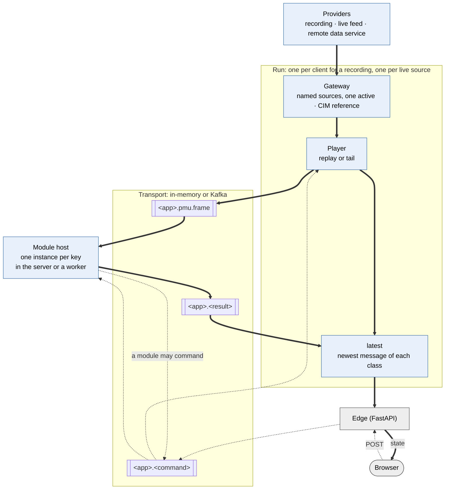

# The server data architecture

How PMU data gets from a source, through analysis modules, to the browser, and
how a command gets back up. The shared pieces live in `core/` (the
`pswamp_core` package). The PMU test streamer (`/pmu-test-streamer`) is the
worked example of every piece.

| If you want to… | Read |
|---|---|
| add a module and its page | `doc/module-cookbook.md` |
| serve a deployment's history to p-SWAMP | `doc/remote-data-integration-contract.md` |
| understand a piece | "The pieces" below, then the class docstrings |

## What it has to do

- Take PMU data from several kinds of source: a recording, a live feed, or a
  remote data service run by the deployment.
- Pass it through swappable analysis **modules**, each with a clear contract
  for what it reads and what it publishes, and on to the web frontend.
- Let a module run in the server or in a process of its own (a pod, a compose
  service), so a heavy module cannot stall the rest.
- Declare a **pipeline**: its sources and the modules that process them.
- Carry messages over topics behind a **transport** interface. Kafka is the
  default; replacing it (with NATS, say) means adding one class.
- Send typed **commands** upstream from any part, handled by the part that
  declares them.
- Add a CIM reference to each frame early, so any module can look up grid
  data.
- Share a live pipeline between every viewer. Give each client (browser, by
  client id) its own replay of recorded data.
- Run the same way in compose, in minikube, and in a cloud cluster.

## Vocabulary

| Term | Meaning |
|---|---|
| message | A pydantic model with a schema version. Everything that crosses a topic, a socket or a process boundary is one. |
| `PmuFrame` | One instant of every channel in a stream, carrying its channel layout (`PmuHeader`). |
| provider (`DataClient`) | One source of data: a *history* (seekable) or a *live* feed (tailed from now). |
| gateway | A pipeline's providers as named sources, one of them active. Enriches every frame on the way out. |
| player | Paces the active source: replays a history in real time or tails a live feed. Owns the transport controls. |
| transport | Keyed publish/subscribe: in-memory in one process, or Kafka between processes. |
| topic | `<app>.<message class>`, e.g. `pmu-test-streamer.pmu.frame`. One class per topic. |
| key | Which pipeline run a record belongs to: a client id, or `live.<source>`. |
| module | Reads one message class, publishes a result class, and may answer commands. |
| host / worker | A host runs one module instance per key. A worker is a process that runs hosts. |
| pipeline | The declaration: an app's sources and modules. |
| run | One running pipeline under one key: a gateway, a player, and the latest message of each class. |
| edge | The app's FastAPI package: POSTs become commands, and the socket pushes state. |
| command | A typed message going upstream. Its class decides who handles it. |

## The picture

```
DATA DOWN    provider → gateway (enrich) → player → topic <app>.pmu.frame → module → topic <app>.<result>
             → the run's latest → edge → socket → browser
COMMANDS UP  browser → POST → edge → topic <app>.<command> → player | module
             a module may publish a command too
WHERE        in-memory transport: modules hosted in the server; Kafka: modules in workers
```


```mermaid
flowchart TB
    classDef data fill:#e8f1fb,stroke:#3b6ea5,color:#000
    classDef edge fill:#eeeeee,stroke:#555,color:#000

    sources["Providers<br/>recording · live feed · remote data service"]:::data
    subgraph run["Run: one per client for a recording, one per live source"]
        direction TB
        gw["Gateway<br/>named sources, one active · CIM reference"]:::data
        player["Player<br/>replay or tail"]:::data
        latest["latest<br/>newest message of each class"]:::data
    end
    subgraph transport["Transport: in-memory or Kafka"]
        direction LR
        frames[["&lt;app&gt;.pmu.frame"]]
        results[["&lt;app&gt;.&lt;result&gt;"]]
        commands[["&lt;app&gt;.&lt;command&gt;"]]
    end
    host["Module host<br/>one instance per key<br/>in the server or a worker"]:::data
    edge["Edge (FastAPI)"]:::edge
    browser(["Browser"]):::edge

    sources ==> gw ==> player ==> frames ==> host ==> results ==> latest
    player ==> latest ==> edge ==>|"state"| browser

    browser -.->|"POST"| edge -.-> commands
    host -.->|"a module may command"| commands
    commands -.-> player
    commands -.-> host
```

Thick arrows carry data and dotted arrows carry commands. Every arrow carries a
message, and the browser's TypeScript types are generated from the same
classes.

## Per client and shared

| | Recorded source | Live source |
|---|---|---|
| run key | the client id | `live.<source>` |
| runs | one per client, with its own cursor and speed | one per live source, always on |
| player controls | play, pause, step, seek, speed | none: a live feed is followed |
| modules | one instance per client | one instance, results shared |

*What.* Each client has its own run, and picks its source with
`SwitchSourceCommand`. On a recording, the client's player replays it. Each
live source has one shared run, keyed `live.<source>`, which `serve_pipeline`
starts with the app (`start_live_runs`) and stops at shutdown. A client's run
switched to a live source opens no stream: its player reports "live", and the
run follows the shared run's frame and result topics into its own `latest`.
The edge reads a client's run the same way in both cases.

*Why.* Everyone watching live must see the same instant, and its analysis
should run once, however many people watch. A visitor exploring recorded data
wants their own clock. Always on means live analysis runs with no viewer too,
as it would in a control room. Topics are shared by every key of an app; the
record key keeps runs apart.

*Where.* `core/src/pswamp_core/pipeline.py` (`start_live_runs`,
`PipelineRun._follow`), `player.py` (`follow_live`), `shared.serve_pipeline`.

## Where it runs

With no transport configured, the server uses the in-memory transport and
hosts the modules itself: one container, no broker. Tests and CI use this
mode. In compose and k8s, the server and one or more workers share a Kafka
broker, and each worker hosts the modules it is told to. The code path is the
same in both; only the transport differs.

A worker is the same image running `python -m pswamp_core.worker`, configured
by the same transport variables as the server plus:

```
PSWAMP_WORKER_PIPELINES=pmu_test_streamer.pipeline:PIPELINE   # whose modules to host
PSWAMP_WORKER_MODULES=range-summary                           # optional: only these
```

So a heavy module gets a process, and a CPU limit, of its own without touching
its code or its page.

## The pieces

### Messages
*What.* Every message is a `DataModel`: a pydantic model with a pinned schema
`version`, an optional `mRID` and a UTC `timestamp`. Its topic is its class
name (`PmuFrame` → `pmu.frame`).

```python
class FrameStats(BaseModel):
    mean_hz: float

class FrameStatsResult(ResultEnvelope[FrameStats]):   # topic frame.stats.result
    version: Literal["v1"] = "v1"

FrameStatsResult.model_validate_json(text)           # the whole codec
```

| Message | Carries |
|---|---|
| `PmuFrame` | One instant of every channel, with its `PmuHeader` (station, channel, measurement and unit per column, data rate, `cimReferenceId`, `header_id`). |
| `Command` | An upstream action. The player's are `Play`, `Pause`, `Step`, `Seek`, `Speed` and `SwitchSource`; a module declares its own. |
| `PlayerStatus` | The player's mode, source, cursor, speed and what it can do. |
| `ResultEnvelope[T]` | A module's result body `T`, with the module's identity and the command it answers, if any. |
| `ErrorEvent` | An operational failure, for the person using the run. |
| `PipelineClosed` | A run stopped; hosts drop its module instances. |

*Why.* One codec from provider to browser. A message can be logged,
validated on receipt, and published in the browser's api contract without an
adapter. A pinned version makes an incompatible payload fail loudly. Every
frame carries its layout, so a module needs nothing but the frame in hand.

*Where.* `core/src/pswamp_core/messages/`.

### Transport
*What.* Keyed publish/subscribe: **one topic per message class, per app, and
the run's key on every record**.

```python
await transport.publish(frame, app="pmu-test-streamer", key="42")   # topic pmu-test-streamer.pmu.frame
with transport.subscribe(FrameStatsResult, app="pmu-test-streamer", key="42") as results:
    async for key, result in results: ...                          # key "42" only
with transport.subscribe(PmuFrame, app="pmu-test-streamer") as frames:
    async for key, frame in frames: ...                            # every key: a module host's view
```

The deployment picks the implementation with `PSWAMP_TRANSPORT`
(`name:module.path:Class`, plus that name's `{NAME}_{SETTING}` variables).
Unset, it is the `InMemoryTransport`. The player and modules publish
synchronously into an `Outbox`, which sends in order and, when full, drops the
oldest data message, but never a command, an answer to one, or an error.

Two classes of one name have the same topic. `subscribe` refuses the second
class on a topic, and `Pipeline` refuses to declare both. Rename one, or give
it a topic of its own (`topic: ClassVar[str]`).

*Why.*
- **One mechanism.** A module is always reached over the transport, so "in
  the server" and "in a worker" are two transports, not two code paths.
- **The in-memory transport behaves like a broker.** Every message goes
  through JSON, and a topic carries one exact class. A message that would not
  survive Kafka fails in a unit test.
- **Replaceable.** A new transport implements `publish` (and `_watch` for
  incoming topics) and passes `core/tests/transport_suite.py`.
- **A transport is not a data source.** It carries what is published, in
  order, and keeps nothing for late subscribers.

**Kafka.** `KafkaTransport` (`kafka:pswamp_core.transport.kafka:KafkaTransport`
with `KAFKA_BOOTSTRAP_SERVERS`) creates each topic with one partition and
about a minute of retention. It reads every topic its process listens to with
one consumer, from the topic's end, with no consumer group. Compose runs the
broker as `kafka` (Apache Kafka, one KRaft node, no volume).

*Where.* `core/src/pswamp_core/transport/`, `subscription.py`, `settings.py`
(spec loading, shared with the data providers); `core/tests/transport_suite.py`
(run against the compose broker with
`KAFKA_TEST_BOOTSTRAP_SERVERS=127.0.0.1:19092`).

### Modules
*What.* A module reads one message class and publishes a result class; it may
also answer commands.

```python
class FrameStatsModule(Module):
    name = "frame-stats"
    input_model = PmuFrame
    output_model = FrameStatsResult            # a ResultEnvelope subclass

    async def process(self, frame: PmuFrame) -> FrameStats | None: ...
```

A module that answers commands lists their concrete classes in `commands`
and implements `handle`, and `validate` if it can refuse one. What `handle`
returns is published like a `process` result, carrying the command's
`request_id`. A refusal or failure is published as an `ErrorEvent` carrying it
too.

A `ModuleHost` runs a module. It subscribes to the module's input and command
topics for every key, and builds one instance per run key on that key's first
message. It drops the instance when the run publishes `PipelineClosed`, or
after five minutes with nothing for it.

An instance that fails (its `setup` raises, say) is logged, reported as an
`ErrorEvent` under its key, and dropped. The first message for that key five
seconds later builds a new one; what arrives before is ignored. A `process`
that raises, or returns a body that does not fit the envelope, costs only that
input: it is reported and the next one is read.

**A pipeline of modules.** A module may read another module's result class,
which chains them: in the streamer, `PmuFrame` → `FrameStatsModule` →
`FrameStatsResult` → `ExcursionModule` → `ExcursionResult`. A module may
publish a command into its sink too: `ExcursionModule` publishes
`PauseCommand` when the frequency leaves its band and auto-pause is on, and
the player applies it exactly as one from the edge. A module that sets
`reads_gateway = True` gets its own gateway over the pipeline's sources
(`self.gateway`). `RangeSummaryModule` answers `SummarizeRangeCommand` with it:
a batch query that runs in a worker of its own.

*Why.* A contributor writes the analysis and three class attributes. The
module never sees the transport: it reads a queue and publishes into a sink.
That lets the same module run in the server or in a worker. Reading the layout
off `frame.header` means it needs no configuration. `process` runs on the
event loop; a CPU-heavy module runs its analysis in a thread or process pool.

*Where.* `core/src/pswamp_core/modules.py`, `host.py`, `command_routing.py`;
the examples are `stats_module.py`, `excursion_module.py` and
`range_summary_module.py` in `app/server-python/src/pmu_test_streamer/`.

### Gateway and providers
*What.* A provider implements `DataClient`: it is a `history` (it holds a
range, reports it as `coverage`, and yields any part of it) or a `live` feed
(it yields records as they arrive). A `DataGateway` holds a run's providers as
named sources, one of them active.

```python
class SampleRecordingClient(DataClient):
    kind = "history"
    async def coverage(self): return self.recording.coverage          # [first, end)
    async def consume(self, time_range):
        for frame in self.recording.frames:
            if time_range.contains(frame.timestamp):
                yield frame

gateway = DataGateway([SampleRecordingClient("sample"), LiveClient("live")])
gateway.switch("live")                            # only an explicit switch changes the source
stream = await gateway.consume(start=t0)          # a seek
chunk = await gateway.consume(start=t0, end=t1)   # exactly [t0, t1)
```

*Why.* A provider is written against the contract alone, so a deployment can
write its own outside this repo. `pswamp_core.testing.DataClientConformance`
is the executable contract: inherit it, supply the client, and pytest checks
it. With one source active at a time, a stream always has exactly one provider
behind it. "Jump to a time" and "query a chunk" are the same call. The gateway
opens a client on first use, so a source nobody reads costs nothing. History
lives with the provider: the repo stores nothing.

**Configured, not coded.** An app's sources come from `<APP>_DATA_CLIENTS`,
with a default in the app's `pipeline.py`. Each client reads its own
`{NAME}_{SETTING}` variables:

```
PMU_TEST_STREAMER_DATA_CLIENTS=sample:pmu_test_streamer.sample_client:SampleRecordingClient,live:acme.pmu:KafkaFeed
LIVE_BOOTSTRAP_SERVERS=kafka.acme:9092
```

A deployment plugs in its own provider with one package in the image and one
variable.

*Where.* `core/src/pswamp_core/datagateway/`, `settings.py`, `testing.py`;
the examples are `app/server-python/src/pmu_test_streamer/sample_client.py`
(history) and `live_client.py` (live: the sample re-stamped on the wall clock).

### CIM reference
*What.* The gateway sets an optional `PmuHeader.cimReferenceId` on every
frame: an id for the grid (CIM) data that applies to it. Enrichers passed to a
`DataGateway` run on every record its streams yield. `CimReferenceEnricher`
decides the reference once per layout. **It is a stub**: it returns one
configured id (`PMU_TEST_STREAMER_CIM_REFERENCE`, default `n44-cim-stub`,
`none` for none). A lookup against a CIM model overrides `reference_for` and
nothing else changes.

*Why.* Every reader's frames pass through the gateway, so every module sees
the same reference, decided once, early. It travels with the frame, so a module
in a worker gets it with no configuration of its own. It is a reference, not
the grid data itself, which would cost kilobytes per frame.

*Where.* `core/src/pswamp_core/datagateway/enrich.py`; wired in
`pmu_test_streamer/pipeline.py`.

### Player
*What.* Paces the run's active source and owns the transport controls.

```python
player = Player(gateway, sink, loop=True)
await player.start()        # a recording: paused at its start; a live feed: followed from now
player.validate(command)    # raises CommandRefused: the edge's 409
await player.handle(command)
player.status()             # PlayerStatus: mode, source, cursor, speed, can_seek, error, ...
```

*Why.* A provider yields as fast as it reads, but a person watching a
disturbance needs real time and needs to scrub. The rules:

- **Mode is the active source's kind.** A recording is replayed: paced, seekable,
  looping at its end. A live feed is followed, with no transport controls. The
  status carries `mode`, `sources` and `can_seek`, so a page shows no dead
  buttons.
- **Paused, it shows the frame at its cursor.** Start, seek, step and a switch
  to a recording each publish the frame there.
- **A seek is a new stream.** A seek with `end_offset_s` plays that chunk and
  stops, paused.
- **Pacing drops time rather than bursting** when it falls behind.
- **A provider failure stops the stream loudly**: paused, `error` set, an
  `ErrorEvent` published. Play tries again.
- **One task** reads the stream, paces, and applies the commands `handle`
  queues for it. No locks, and a quiet live feed never delays a command.

*Where.* `core/src/pswamp_core/player.py`.

### Pipelines and runs
*What.* A `Pipeline` declares an app's pipeline once: the app name (its topic
namespace), its sources and its modules. A `PipelineRun` is one running
instance under one key. A `PipelineRegistry` keeps one run per key.

```python
PIPELINE = Pipeline("pmu-test-streamer", gateway, modules=(FrameStatsModule,))   # <app>/pipeline.py

REGISTRY = PipelineRegistry(lambda key: PipelineRun(key, PIPELINE, transport))
run = await REGISTRY.acquire(client_id)       # built on first connect
run.latest.get(FrameStatsResult)              # the newest result: what the edge renders
with run.changes() as changes: ...            # a wake-up per change, coalesced
REGISTRY.peek(client_id)                      # a command's view: never builds
```

*Why.* The declaration is what both sides share. The server builds runs from
it, and a module host, in the server or a worker, hosts its modules from it
(`PIPELINE.hosts(transport)`). A run holds a gateway and a player, publishes
the player's frames to the modules, and keeps the newest message of each class
it sees. That view is not a bus: the edge builds its message from current
state, so however much arrived meanwhile, it sends one. The registry lets a
run outlive its sockets for five minutes, so a reload rejoins it. At its cap
(8) it evicts the least recently used idle run, and refuses when every run is
watched.

*Where.* `core/src/pswamp_core/pipeline.py`, `worker.py`;
`app/server-python/src/pmu_test_streamer/pipeline.py`.

### Commands
*What.* A command's class is its address. Exactly one part of a pipeline
declares that it handles it: the player, or one module. The command travels on
its own topic, `<app>.<command>`, under the run's key.

```python
run.dispatch(SeekCommand(client_id=id, offset_s=12))
#   a player command?  player.validate(cmd)    raises CommandRefused: the POST's 409
#   a module command?  published as it is       the module validates it where it runs
#   nobody takes it?   NoReceiver
#   then               topic pmu-test-streamer.seek.command, key = the run's key
# the receiver's CommandInbox: validate again, then handle; a refusal is an ErrorEvent(request_id)
```

*Why.* The mental model is one sentence: **anyone may publish a command, its
one declared receiver applies it, anyone may subscribe to watch it.** The
arguments are validated fields, not a verb and a dict. `Pipeline` refuses two
receivers of one class. The player lives with the edge, so its commands are
checked before they are published, and a refusal is an honest 409. A module
may run in another process, so its commands are checked where it runs, and a
refusal comes back as an `ErrorEvent`. Player commands also travel on topics,
so a module can command the player exactly as the edge does.

*Where.* `core/src/pswamp_core/command_routing.py`, `messages/commands.py`,
`pipeline.py` (`dispatch`).

### The edge
*What.* What an app's `api.py` keeps once the core does the rest: the state
message it pushes, and the POSTs that build commands.

```python
REGISTRY = PipelineRegistry(lambda client_id: PipelineRun(client_id, PIPELINE, transport()))

@router.post("/playback/seek", responses=COMMAND_RESPONSES)
async def seek(client_id: ClientId, body: SeekBody) -> CommandAck:
    return dispatch_command(REGISTRY, SeekCommand(client_id=client_id, **body.model_dump()), logger)

@router.websocket("/ws")
async def ws_endpoint(ws: WebSocket) -> None:
    async with connected_pipeline(ws, REGISTRY) as run:
        if run is not None:
            await push_changes(ws, run, lambda: state_message(run))
```

*Why.* The shared pieces are in `shared.py`:
- `transport()`: one per process, from `PSWAMP_TRANSPORT`.
- `serve_pipeline`: the app's lifespan. It starts the shared live runs,
  forwards the error topic to the tray, hosts the modules in the server when
  the transport is in-memory, and stops every run on the way out.
- `connected_pipeline`: the socket's handshake, with close codes 1008 (no
  client id), 1013 (at capacity) and 1011 (the run failed to start).
- `push_changes`: one message on connect and one per change, coalesced.
- `dispatch_command`: 404 without a run, 409 when the player refuses, else a
  `CommandAck` meaning *accepted*: the command is queued for its receiver. The
  ack carries the command's `request_id`, as does whatever answers or refuses
  it.

The browser contract is unchanged: commands up as POSTs, state down one
socket, the acknowledgement never carries state, and all of it is generated
into `doc/api/openapi.json`. The state message carries core messages
(`PmuFrame`, `PlayerStatus`, a `ResultEnvelope`) as they are, so the page's
types are generated from the same classes.

*Where.* `app/server-python/src/shared.py`, `pmu_test_streamer/api.py`;
`app/client-web/src/pages/pmu-test-streamer/`.

### Errors
*What.* `ErrorEvent` is what a pipeline publishes when something *operational*
fails: the player's provider raised, a module's `process` raised, a module
instance failed, or a module refused a command. Every one goes on the app's error topic
(`<app>.error.event`) under its run's key. `serve_pipeline` forwards that
topic to the `errors` app's hub. Each notice goes to the clients watching that
run: its own client, or every client following a shared live run. The
layout's `<ErrorTray>` shows them on every page, from `/api/errors/ws`.

*Why.* The log line stays the source of truth; the notice is a copy addressed
to the person whose run it was. It is how a module command's refusal reaches
the browser, since that command was accepted with a 200 before the module saw
it. It is not a grid alarm: an alarm is a module's normal result.

*Where.* `core/src/pswamp_core/messages/errors.py`;
`app/server-python/src/errors/`, `shared._forward_errors`;
`app/client-web/src/components/ErrorTray.tsx`, `hooks/useErrorFeed.ts`.

### Keeping up
*What.* A module that falls behind its input reports it. Its `KeepUpMonitor`
watches its input queue: input the `DROP_OLDEST` queue discarded, and how long
each input had been in flight when read (transports stamp the send time,
`messages.sent_at`, never on the wire). Past the module's `keep_up` policy (by
default any drop, or input older than 2 s), it reports once on falling behind,
at most every 5 s while behind, and once on catching up. A run's outbox does
the same when it has to drop what it cannot publish.

*Why.* Dropping stale frames is right for a live stream, and silent. Under
load, that silence hides exactly what an operator needs to know. The reports
are `ErrorEvent`s, so they reach the error tray.

*Where.* `core/src/pswamp_core/keep_up.py`; `Module.run`, `Outbox`.

### Remote data
*What.* `RemoteDataClient` is a history data client over a deployment's own
remote data service: a small REST api in front of whatever store holds its
history. Coverage is `GET /v1/coverage`. A range is `POST /v1/queries`, and its
records come back as that call's streamed response, one NDJSON line each,
closed by an `end` line. **The contract is
`doc/remote-data-integration-contract.md`**, in HTTP terms alone. In compose
and k8s, `remote-data-stub` serves the streamer's sample recording over it,
and the streamer lists it as its third source, `remote`.

*Why.* p-SWAMP asks for a range and gets it back; which store answers is the
deployment's choice, and the repo stores nothing. The answer comes on the
connection that asked, so the contract has no correlation ids, no second
channel and no cancel route: closing the connection cancels. It also gives
backpressure for free. A command never reaches the service. It stops at the
player, which seeks, or at a module, which reads a range from its gateway
like anyone else (the range summary).

*Where.* `core/src/pswamp_core/datagateway/clients/remote_data.py`,
`messages/remote_data.py`, `core/examples/remote_data_stub/`;
`core/tests/test_remote_data.py` runs the conformance suite over the stub.

### Deployment
*What.* One image, several roles, configured by environment:

| Role | Command | Configured by |
|---|---|---|
| server | the image's default (`python server.py`) | `PSWAMP_TRANSPORT`, `<APP>_DATA_CLIENTS` and their `{NAME}_*` blocks |
| worker | `python -m pswamp_core.worker` | the same transport, `PSWAMP_WORKER_PIPELINES`, `PSWAMP_WORKER_MODULES`; a module that reads the gateway also needs `<APP>_DATA_CLIENTS` |
| remote data stub | `python -m remote_data_stub` | `REMOTE_DATA_STUB_CLIENT` (and `core/examples` on `PYTHONPATH`) |
| broker | `apache/kafka` | one KRaft node, topic auto-creation off, 10 s retention checks |

- **Bare `docker run`** (CI's e2e): no transport set, so it is in-memory. The
  server hosts every module; the sources are sample and live.
- **Compose** (`docker-compose.yml`): `server`, `module-worker`
  (frame-stats, excursion), `batch-worker` (range-summary, one CPU),
  `remote-data-stub`, `kafka`.
- **Minikube** (`k8s/p-swamp-local.yaml`, via
  `scripts/start-pswamp-in-local-minikube-cluster.sh`): the same five, and the
  live feed reads a file from a ConfigMap.

**A cloud cluster** starts from `k8s/p-swamp-local.yaml` and changes:
- **Image**: pushed to the deployment's registry at an immutable tag
  (`imagePullPolicy: IfNotPresent`), built from this repo's Dockerfile; this
  repo publishes no image.
- **Ingress**: an Ingress or LoadBalancer in place of the NodePort. The web
  client works under a path prefix (`/p-swamp/`) as it is.
- **Kafka**: the deployment's own broker. Set `KAFKA_BOOTSTRAP_SERVERS` and
  `KAFKA_REPLICATION_FACTOR`, and apply the retention settings the transport
  asks for (`LIVE_TOPIC_CONFIGS`) or an equivalent broker policy. Drop the
  `p-swamp-kafka` Deployment.
- **Data**: the deployment's remote data service in `REMOTE_URL`, its live
  feed as a `DataClient` class in `<APP>_DATA_CLIENTS` (an image layered on
  this one), and no stub.
- **Resources**: CPU limits per worker, sized by what each module costs.
- **Replicas stay at 1** for the server and each worker, until topics are
  partitioned and workers join consumer groups ("Not here yet").

*Why.* Where a module runs is configuration, not code, so a heavy module gets
its own pod and CPU limit without touching its code or its page. The repo
holds no deployment-specific configuration: the local manifests are examples,
and a deployment's own sources and broker come in through the same variables.

*Where.* `Dockerfile`, `docker-compose.yml`, `k8s/`,
`scripts/start-pswamp-in-local-minikube-cluster.sh`.

## Adding a module

`./scripts/generate-new-module-with-frontend.sh <slug> "<Label>"` writes a
working module, its pipeline, api, page and tests, and adds it to the
module-worker. Then replace the placeholder analysis.
`doc/module-cookbook.md` covers the rest: tests, logs, commands, chaining,
batch queries, a worker of its own, CPU-heavy modules, and data sources.

## Not here yet

- **The grid monitor on the core.** It still runs its own thread-based
  `Hub`/`Bus` in `pswamp_web/`, beside this architecture.
- **More than one replica** of the server or a worker. Topics have one
  partition and workers no consumer group, so a second worker replica would
  answer every frame twice.
- **A NATS transport**: a `Transport` subclass passing
  `core/tests/transport_suite.py`.
- **A live source over a real feed**, such as a broker's topic read as a
  `DataClient`.
- **Cheaper frames**: the header serialised once per layout, and producer
  batching.
- **A notice when nothing answers a command.** The acknowledgement means
  accepted. A command that never reaches its receiver (its worker is not
  running, the broker is down) is lost with only a log line. The ack and every
  answer carry the `request_id` a watchdog would match on.
- **Security** between p-SWAMP and a remote data service, and limits on
  queries (see the contract's "Not settled yet").
